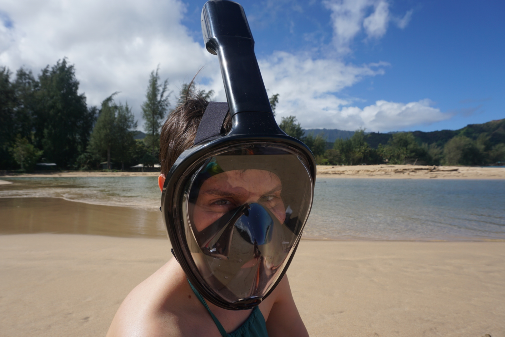

2019 was a year of 4 weddings (the fourth and final thanks to an elopement we unwittingly crashed, congrats John & Sara!), 2 gifted wedding eggs (congrats Robin & Mark!), 1 adopted cat and 9 states visited (excluding home state NY that's RI, MA, HI, VA, MD, PA, CA, CT and NJ.)

If you've found your way here, take a minute and join us for a whip around the last 12 months.

### Carla

Since being admitted to the CJA (Criminal Justice Act) panel for federal indigent defense in January, Carla's practice has been growing apace. While running her own business and keeping one of the busiest schedules of anyone I know, she nevertheless manages to Citi bike to midtown most days and care for not one but two small creatures, in addition to me.

Carla continues to earn the title of "Neighbourhood Pied Piper of Adorable Animals": most everyone knows [Peter Carlos](https://twitter.com/alessbell/status/1174662627093602306), the good-natured chicken who walked into Carla's life three years ago and never left. 2019 in turn brought us Ghost, a young cat with white fur and a little grey cap.

Our friend [Andrew](https://law-mf.com/), a person with far too much idle time on his hands, lovingly built Ghost [a cat ladder up to our second story apartment](https://twitter.com/alessbell/status/1186300433633075201) so Ghost could begin to get acquainted with his new home. The ladder was a hit and, so far, it seems he likes what he's found at the top.

Finally, an affable web developer offered to make Carla a new website; in June the new and improved [carlasandersonlaw.com](https://carlasandersonlaw.com) came online.

### The Bellisarios

**Erica** and **Santino** were thrilled to have their three kids along for the ride in Rome this July, in addition to the sixty-odd other kids they were legally responsible for.

**Luca**, ever the peacemaker and overall agreeable Bellisario, had no trouble making new friends in Italy despite the language barrier.

An older gentleman living near our hotel would see Luca on his way to the subway and wave him over for some help navigating Rome's precarious streets. They'd walk together for several blocks until the man would gratefully wave Luca off, having arrived at his destination. In Italy as in life, few words, a smile and many wild gestures can go a long way.

In the spring, Luca graduated with a bachelors degree with high distinction from U of T--no small feat says the woman who did a victory lap and still barely got out alive--and began grad school in the fall, also at U of T.

**Martina**, my big sister in every meaningful way except birth order, wrapped up a stint at a top communications firm in Toronto and began her legal studies. As someone who still bears the battle scars from kitchen table "debates" with Martina over the years, I cannot wait to see the havoc she will wreak in the professional world.

For my part, I had the amazing opportunity to join the [Recurse Center](https://recurse.com) in April for a mini batch, which is to say I spent a week among likeminded programmers learning a new language called Rust. I compiled my Rust to Wasm in order to do some neat interactive stuff in the DOM. In other words, I [drew a bunch of moving circles on a web page](https://happy-faces.glitch.me).

I learned some other things this year, too, like how to [build a split keyboard](https://twitter.com/alessbell/status/1122223104451928064), [how to use a machine to draw on eggs](https://twitter.com/alessbell/status/1155525840882536451), of all things, and how to something.

---

As the year and decade wind down, I am grateful for the chance to spend time with loved ones, even and especially when those loved ones include **three** grandparents who relentlessly pressure me to move home to Toronto.

