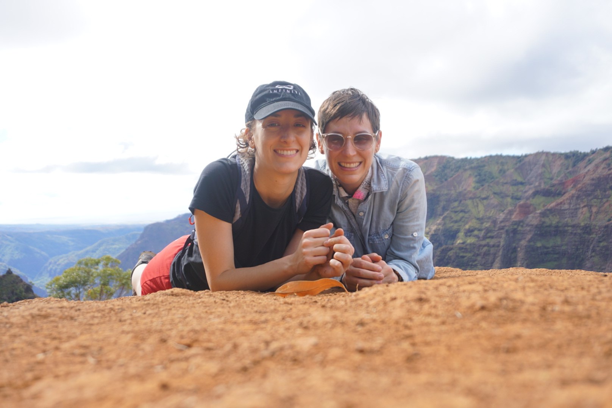
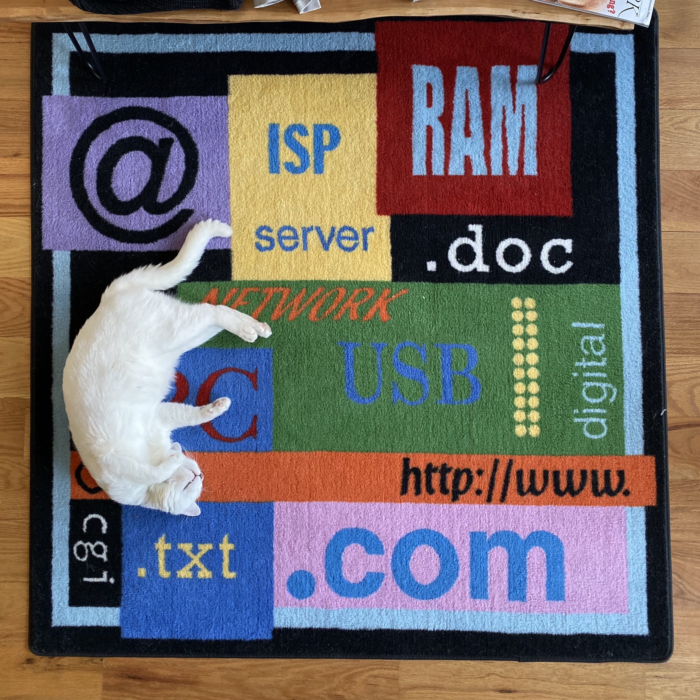
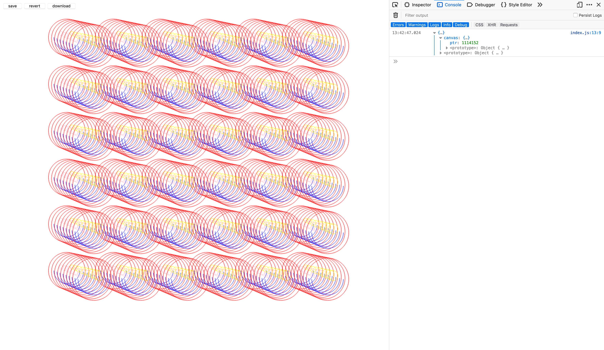
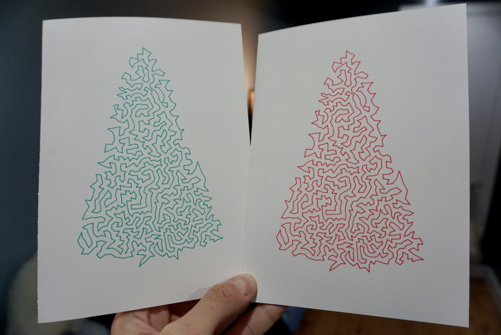

2019 was a year of 4 weddings (the fourth and final thanks to an elopement we unwittingly crashed, congrats John & Sara!), 2 gifted wedding eggs (congrats Robin & Mark!), 1 new baby cousin (technically first cousin once removed, congrats Jess and Anth!), 1 adopted cat and 9 states visited (excluding home state NY that's RI, MA, HI, VA, MD, PA, CA, CT and NJ.)

A friend [inspired me](https://www.alxmnn.com/) to write up a few things that happened this year. If you've found your way here, take a minute and join us for a whip around the last 12 months.

### Carla, Peter & Ghost

Since being admitted to the Eastern District's CJA (Criminal Justice Act) panel for federal indigent defense in January, Carla's practice has been growing apace. While running her own law firm and keeping one of the busiest schedules of anyone I know, she nevertheless manages to Citi Bike to midtown most days and care for not one but two small creatures, in addition to me.

Carla continues to earn the title of "Neighbourhood Pied Piper of Adorable Animals": most everyone knows **Peter Carlos**, the good-natured chicken who walked into Carla's life three years ago and never left. 2019 in turn brought us **Ghost**, a young cat with white fur and a little grey cap.

Our friend [Andrew](https://law-mf.com/), a person with far too much idle time on his hands, lovingly built Ghost [a cat ladder up to our second story apartment](https://twitter.com/alessbell/status/1186300433633075201) so Ghost could begin to get acquainted with his new home. The ladder was a hit and, so far, it seems he likes what he's found at the top.

Finally, an affable web developer offered to make Carla a new website; in June the new and improved [carlasandersonlaw.com](https://carlasandersonlaw.com) came online.

### The Bellisarios

**Erica** and **Santino** were thrilled to have their three kids along for the ride in Rome this July, in addition to the sixty-odd other kids they were legally responsible for.

**Luca**, ever the peacemaker and overall agreeable Bellisario, had no trouble making new friends in Italy despite the language barrier.

An older gentleman living near our hotel would see Luca on his way to the subway and wave him over for some help navigating Rome's precarious streets. They'd walk together for several blocks until the man would gratefully wave Luca off, having arrived at his destination. In Italy as in life, few words, a smile and many wild gestures can go a long way.

In the spring, Luca graduated with a bachelors degree with high distinction from U of T--no small feat says the woman who did a victory lap and still barely got out alive--and began graduate school in the fall, also at U of T.

**Martina**, my big sister in every meaningful way except birth order, wrapped up a stint at a top communications firm in Toronto and began her legal studies at, you guessed it, U of T. As someone who still bears the battle scars from kitchen table "debates" with Martina over the years, I cannot wait to see the havoc she will wreak in the professional world.

On January 21, **Jessica and Anthony** welcomed baby **Giacomo** into the Bellisario and Farrugia broods. He is implausibly chill for an infant, setting the bar nice and high for Bellisario babies to come. His arrival, complete with mini Lowry jersey, also almost certainly spurred the Raptors to their uncharactistic championship. We thank Giacomo for all he has done in his first eleven months with us.

For my part, I had the amazing opportunity to join the [Recurse Center](https://recurse.com) in April for a mini batch, which is to say I spent a week among likeminded programmers learning a new language called Rust. I compiled my Rust to Wasm in order to do some neat interactive stuff in the DOM. _In other words_, I [drew a bunch of moving circles on a web page](https://happy-faces.glitch.me).

I acquired some other useful skills this year, too, like how to [build a "split" keyboard](https://twitter.com/alessbell/status/1122223104451928064) (split right down the middle as the name would indicate), [how to use a robotic arm charmingly named EggBot to draw on eggs](https://twitter.com/alessbell/status/1155525840882536451) and how to make holiday cards using a solution to the Travelling Salesman Problem.

As the year and decade wind down, I'm giddy at the prospect of so much uninterrupted time with loved ones... especially when those loved ones include **three** grandparents who relentlessly pressure me to move home to Toronto ❤️

Sending love to all my friends and family,

\- Alessia
