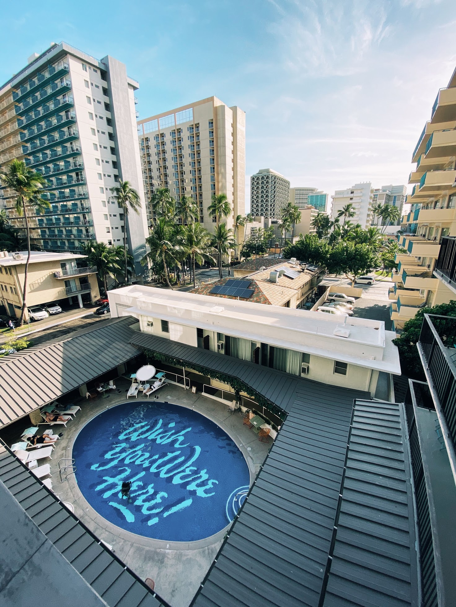

2020 was a year of three weddings (including my own, to [@csandersonlaw](https://twitter.com/csandersonlaw) - congrats Dana & Jon and Lauren & Sean!), two funerals, one apartment fire and a global pandemic. It was also the last year of my twenties: looking at pictures from January, it's almost hard to recognize the person who began the year waltzing around in my clothing.

## January

### Engagement

After a trip to [Warehouse Wines & Spirits](https://www.warehousewinesandspirits.com/) at 8th and Broadway (for drinkable champagne in vast quantities), Carla and I hosted a NYE party with friends in Brooklyn. The next morning, we exchanged the rings we'd both been not-so-secretly harboring and got engaged.

We were excited to tell our families, but first we had a trip lined up: after reaching a five year work anniversary, I was eligible to take a four week sabbatical: on January 16, we headed to JFK en route to Tokyo via Beijing.

### Beijing

We were flying via Beijing both ways: neither of us had ever been to Japan, and Carla had never been to mainland China so we had ambitious plans for our two 24hr layovers.

We landed the evening of the 17th, obtained our temporary tourist visas and headed to our hotel. Initially, we thought we'd hop on a bus to the Great Wall, but this was the shorter of our two layovers and the jet lag was already hitting us. We figured we'd save that day trip for the way home...

### Tokyo

We arrived in Tokyo on my 29th birthday the following day, tired and vibrating with excitement. Carla's cousin Joseph has lived in the city for the last seven years and graciously serves as tour guide/karaoke buddy for family traveling through Japan. He is now also one of just a handful of people who have witnessed my rendition of [_Pour que tu m'aimes encore_](https://www.youtube.com/watch?v=AzaTyxMduH4) -- I was pleased to find the largest catalog of Celine Dion's French music I've seen outside of Québec.

I won't attempt to recap our whole trip: we bought Japan Rail passes and got to experience the unmatched convenience + punctuality of the Shinkansen while visiting Kyoto, Hiroshima, Hakone, Niseko, Sapporo and more. We met so many friendly people along the way and had the trip of our lives, narrowly making it back via Hawai'i as the US borders closed to non-citizens who had visited China in the previous two weeks: on our date of re-entry, our initial Beijing layover was just 16 days prior.

We didn't get to see the Great Wall but we had two days in Honolulu we weren't planning for - two rather than one due to a time zone mix-up. Best mistake ever.

# New job

# Wedding!

## Adirondacks

#
