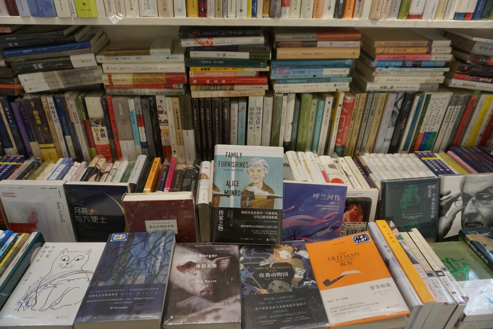
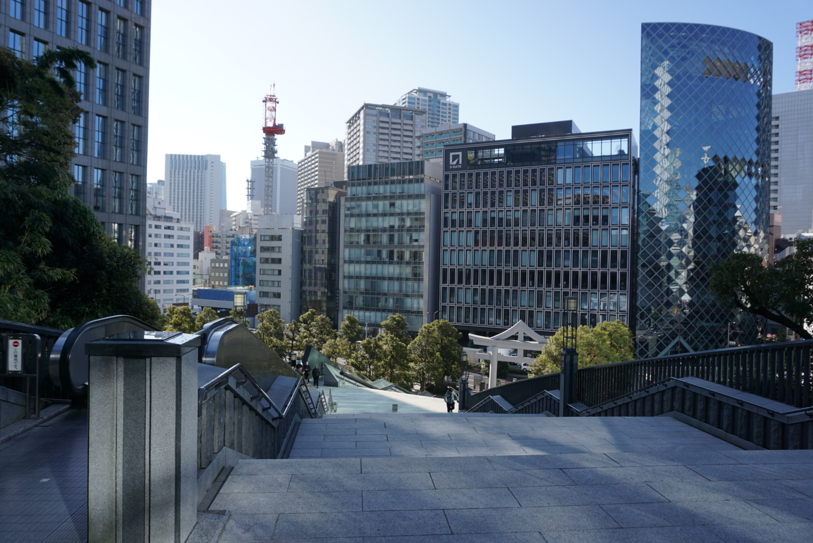
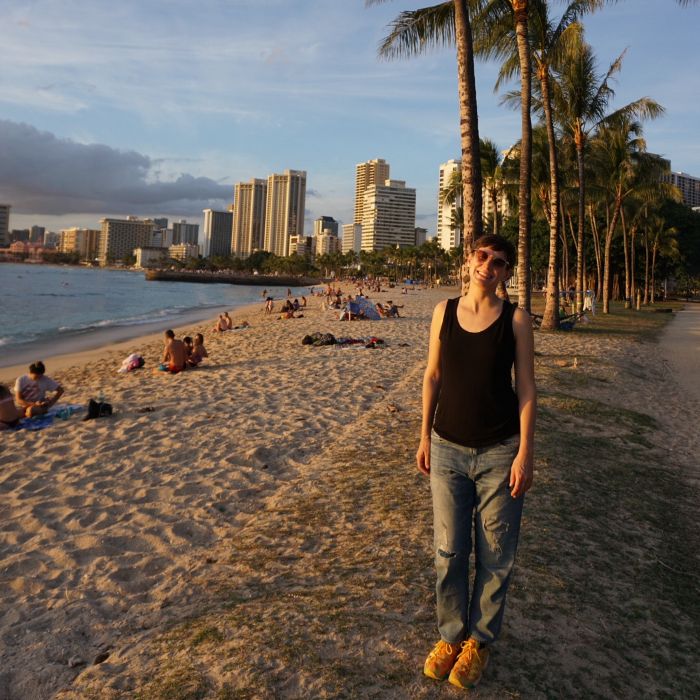
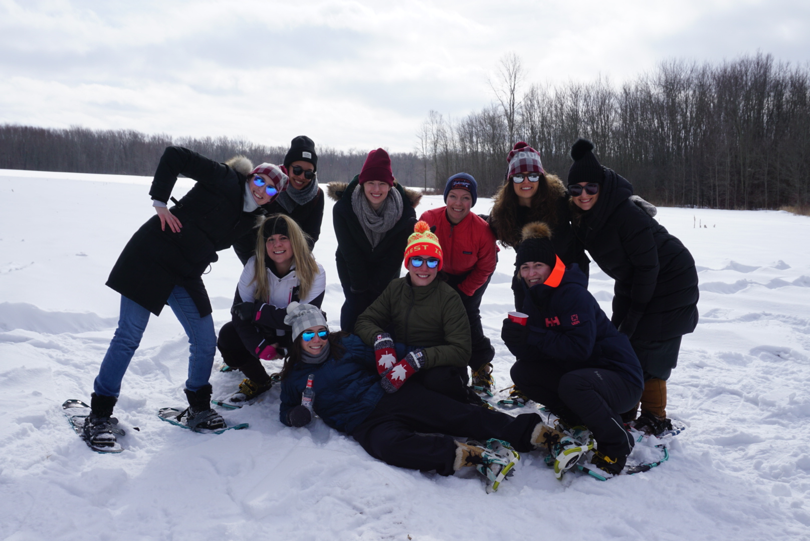
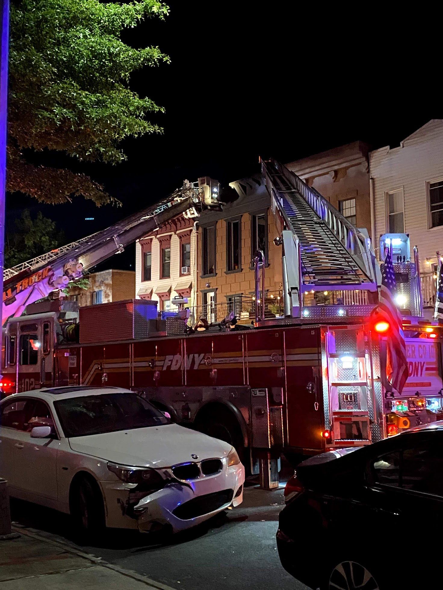
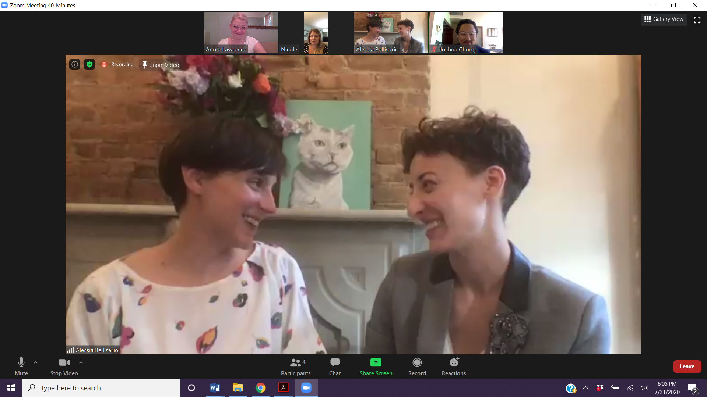
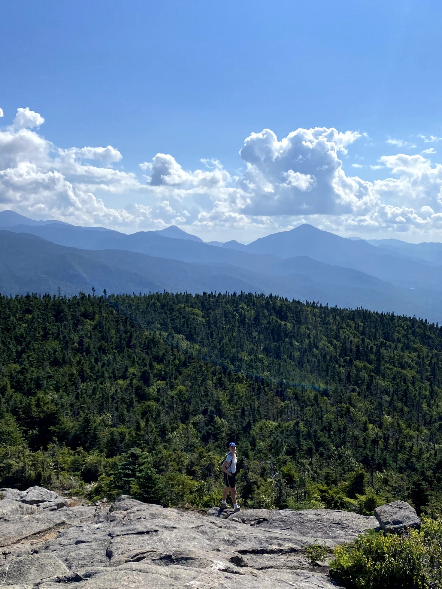
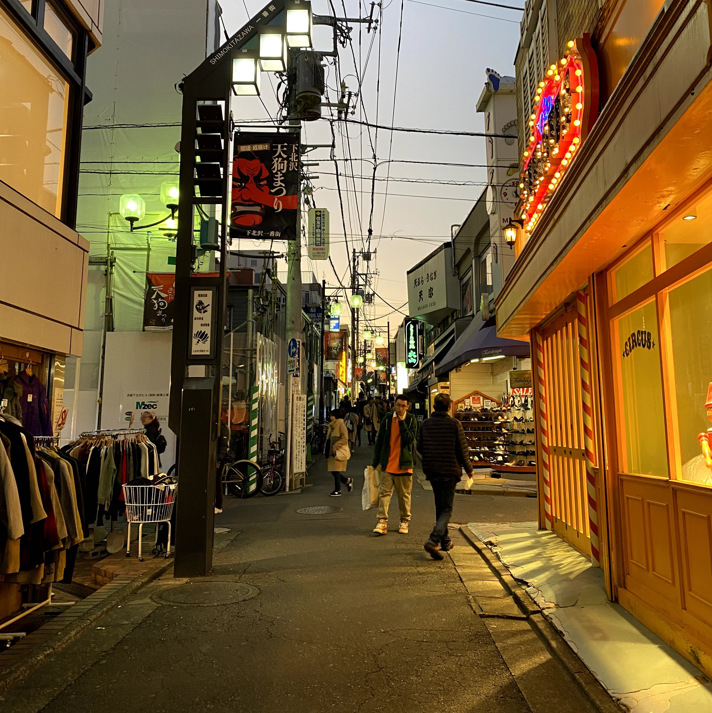

2020 was a year of three weddings (including my own, to [Carla](https://twitter.com/csandersonlaw) - congrats Dana & Jon and Lauren & Sean!), two funerals, one apartment fire and a global pandemic. It was also the last year of my twenties: looking at pictures from January, it's almost hard to recognize the person who began the year waltzing around in my clothing.

## January

After a trip to [Warehouse Wines & Spirits](https://www.warehousewinesandspirits.com/) at 8th and Broadway (for drinkable champagne in vast quantities), Carla and I hosted a NYE party with friends in Brooklyn. The next morning, we exchanged the rings we'd both been not-so-secretly harboring and got engaged.

We were excited to tell our families, but first we had a trip lined up: after reaching a five year work anniversary, I was eligible for a four week sabbatical. On January 16, we headed to JFK en route to Tokyo via Beijing.

### Beijing

We were flying via Beijing both ways and had ambitious plans for our two 24hr layovers.

We landed the evening of the 17th, obtained our temporary tourist visas and headed to our hotel. Initially, we thought we'd hop on a bus to the Great Wall, but this was the shorter of our two layovers and the jet lag was already hitting us. We figured we'd save that day trip for the way home...

### Tokyo

We arrived in Tokyo on my 29th birthday the following day, tired and vibrating with excitement. Carla's cousin Joseph has lived in the city for the last seven years and graciously serves as tour guide/karaoke buddy for family traveling through Japan.

He is now also one of just a handful of people who have witnessed my rendition of [_Pour que tu m'aimes encore_](https://www.youtube.com/watch?v=AzaTyxMduH4) -- I was pleased to find the largest catalog of Celine Dion's French music I've seen outside of Québec.

I won't attempt to recap our whole trip: we bought Japan Rail passes and got to experience the unmatched convenience + punctuality of the Shinkansen while visiting Kyoto, Hiroshima, Hakone, Niseko, Sapporo and more over the course of two weeks. We met so many friendly people along the way, narrowly making it back via Hawai'i as the US borders closed to non-citizens who had visited China in the previous two weeks: on our date of re-entry, our initial Beijing layover was 16 days prior.

We didn't get to see the Great Wall, but we had two days in Honolulu we weren't planning for -- two rather than one due to a time zone mix-up. Best mistake ever!

In February, I squeezed in a trip to SF, a conference (the first ever WebAssembly Summit!) and managed to visit both family and friends back home in Toronto, celebrating a close friend's impending nuptials at her bachelorette in Prince Edward County. 2020 was off to a _strong_ start.

## New job, a fire and a wedding

The first few terrifying weeks of lockdown in NYC began mid-March, followed by an apartment fire at the end of May which started in our next door neighbour's yard and woke us to an apartment filled with thick smoke.

Everyone made it out unscathed, thankfully. The fire came just two weeks after I started a new job which added to the stress of being uprooted -- all told we were out of our apartment for four months. I'm extremely grateful for the support my team gave me in the weeks that followed.

### Project Cupid

By July, with no end to the pandemic in sight, Carla and I decided to use the reservation we'd made as a hedge with New York State's [Project Cupid](nyc.gov/Cupid) to obtain a marriage license via Zoom.

Once we'd gotten the license -- issued by a bureaucrat via DocuSign -- we only needed 1. a minister registered with the city and state to perform Zoom weddings and 2. at least one witness physically located in New York state. We were lucky to find [Reverend Annie](https://www.revannienyc.com/) online and called on our friends Nicole and Josh.

We were spread across Queens and Brooklyn, all except Rev. Annie who performed the virtual ceremony from the West Village. The paperwork is filed in the officiant's borough, so we were officially married in Manhattan on July 31, 2020. 🎉

## Fresh air

We headed north to the Adirondacks in August where we mostly hiked, swam in lakes, worked and roasted marshmallows.

## Year's end

The end of the year has been a blur, not unlike the rest. We're grateful for family and friends with whom we've tried to remain connected, despite great distance and difficulty. Sending warm wishes to you, reader, wherever you are this holiday season.

\- Alessia

