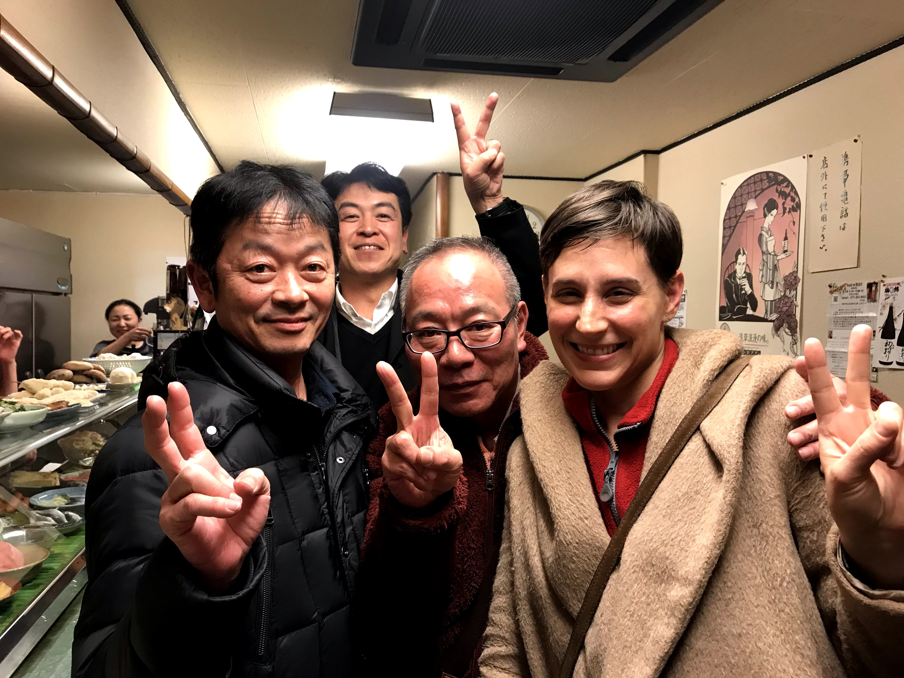

2020 was a year of three weddings (including my own, to [@carlcarlcarlcrl](https://twitter.com/carlcarlcarlcrl) - congrats Lauren & Sean and Dana & Jon!), two funerals, one apartment fire and one of the worst global pandemics of the last hundred years. It was also the last year of my 20s: looking at pictures from January, it's almost hard to recognize the person who began the year waltzing around in my clothing.

## January

The decade began memorably: after a trip to [Warehouse Wines & Spirits](https://www.warehousewinesandspirits.com/) at 8th and Broadway (for drinkable champagne in vast quantities), Carla and I hosted a NYE party with friends in Brooklyn. The next morning, we exchanged the rings we'd been harboring for a while and got engaged.

We were excited to tell our families, but first we had a trip lined up: after reaching my five year work anniversary at Breather, I was eligible to take a four week sabbatical. On January 16, we set off for JFK en route to Tokyo.

We were flying Air China via Beijing both ways: neither of us had ever been to Japan, and Carla had never been to China, so we had ambitious plans for our two 24H layovers.

