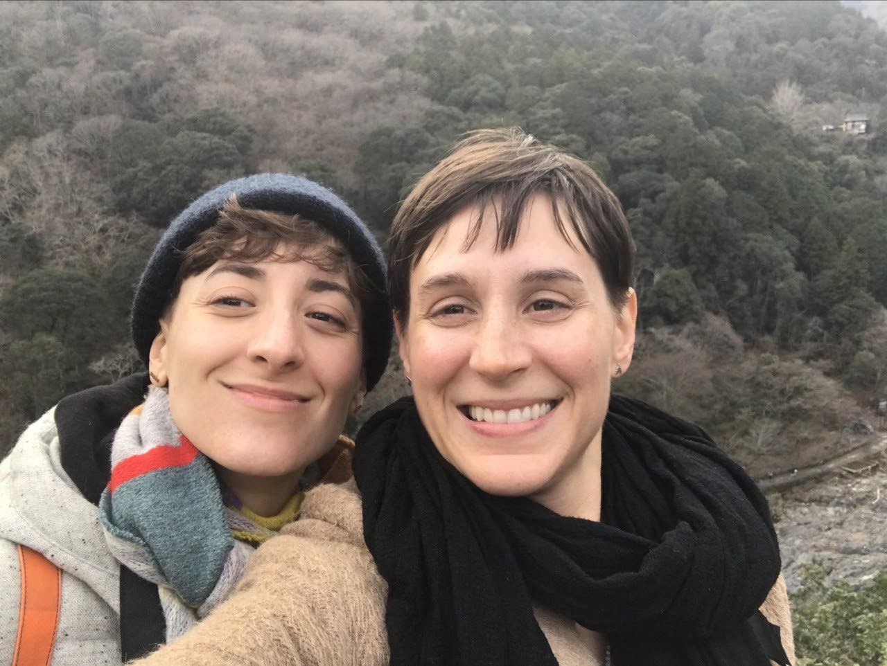
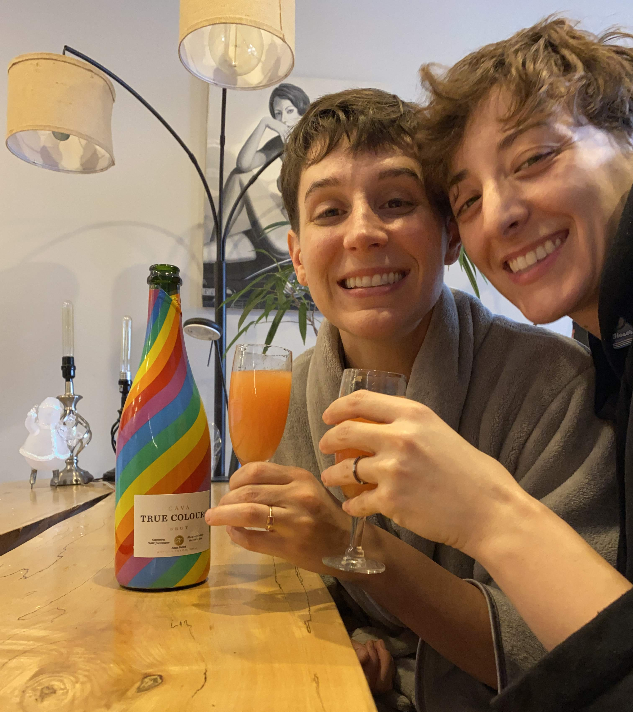
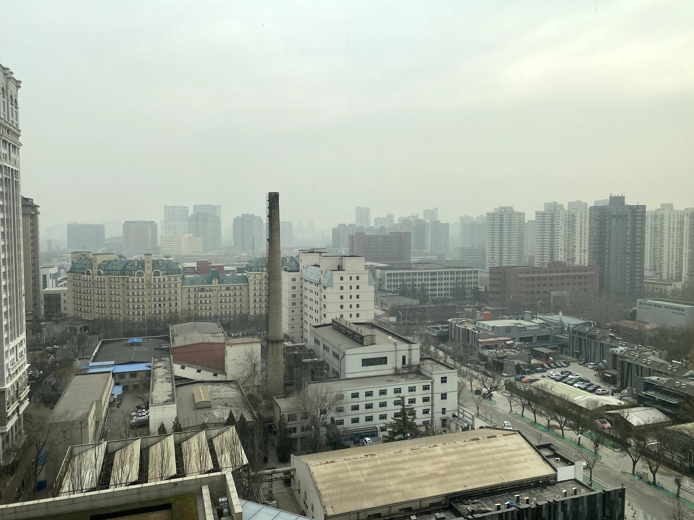
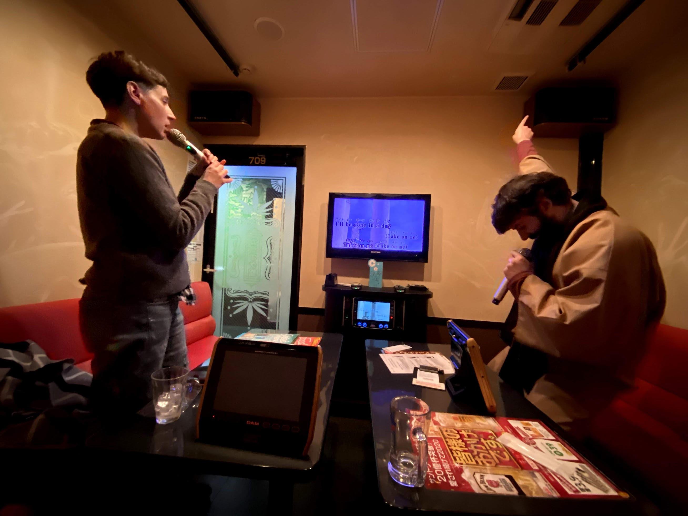
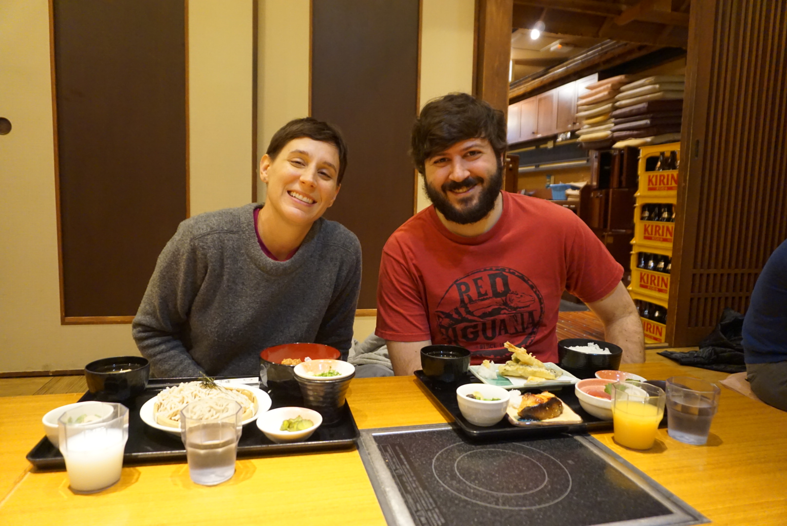
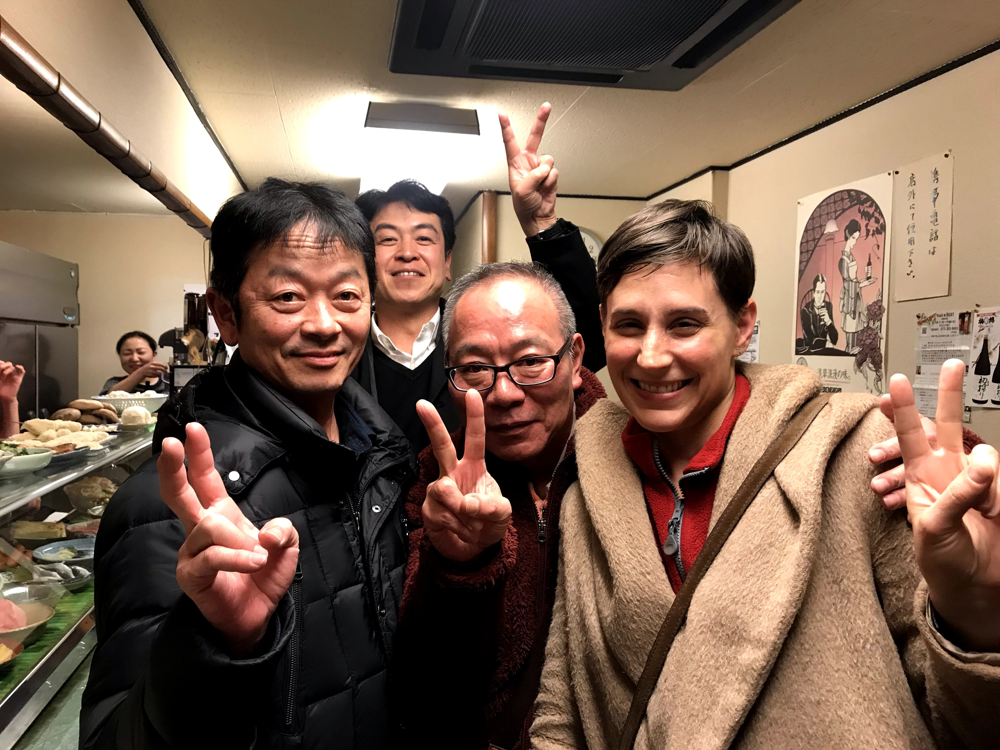

2020 was a year of three weddings (including my own, to [@carlcarlcarlcrl](https://twitter.com/carlcarlcarlcrl) - congrats Lauren & Sean and Dana & Jon!), two funerals, one apartment fire and one of the worst global pandemics of the last hundred years. It was also the last year of my twenties: looking at pictures from January, it's almost hard to recognize the person who began the year waltzing around in my clothing.

## January

### Engagement

The decade began memorably: after a trip to [Warehouse Wines & Spirits](https://www.warehousewinesandspirits.com/) at 8th and Broadway (for drinkable champagne in vast quantities), Carla and I hosted a NYE party with friends in Brooklyn. The next morning, we giddily exchanged the rings we'd been harboring and got engaged.

We were excited to tell our families, but first we had a trip lined up: after reaching a five year work anniversary, I was eligible to take a four week sabbatical: on January 16, we set headed to JFK en route to Tokyo.

### Beijing

We were flying Air China via Beijing both ways: neither of us had ever been to Japan, and Carla had never been to China so we had ambitious plans for our two 24hr layovers.

We landed the evening of the 17th, applied for our temporary tourist visas recently introduced for short layovers and headed to our hotel. Initially, we thought we'd hop on a bus to visit the Great Wall, but this was the shorter of our two layovers and the jet lag was already hitting us. We figured we'd save that day trip for the way home...

Instead, we walked a few neighborhoods over to the [798 Art Zone](https://en.wikipedia.org/wiki/798_Art_Zone) district and checked out some museums before heading back to collect our things on the way to our next flight to Narita.

### Tokyo

We arrived in Tokyo on my 29th birthday, tired and vibrating with excitement. Carla's cousin Joseph has lived in the city for the last seven years and graciously serves as tour guide/karaoke buddy for family traveling through Japan. (He is now also one of just a handful of people who has witnessed my attempt at _Pour que tu m'aimes encore_ -- I was pleased to find the largest catalog of Celine Dion's French music that I've seen outside of Québec.)

If I attempted to recap our whole trip, we'd be here a while. We bought Japan Rail passes and got to experience the unmatched convenience + punctuality of the Shinkansen while visiting Kyoto, Hiroshima, Hakone, Hokkaido and more.

