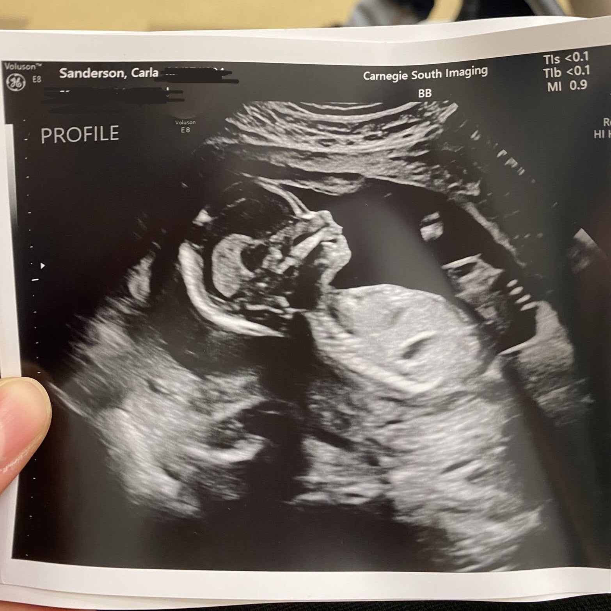
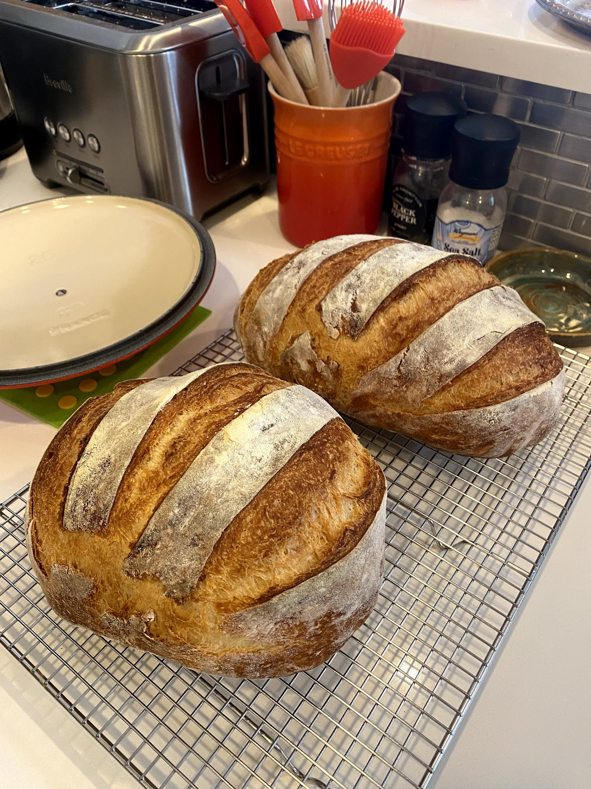
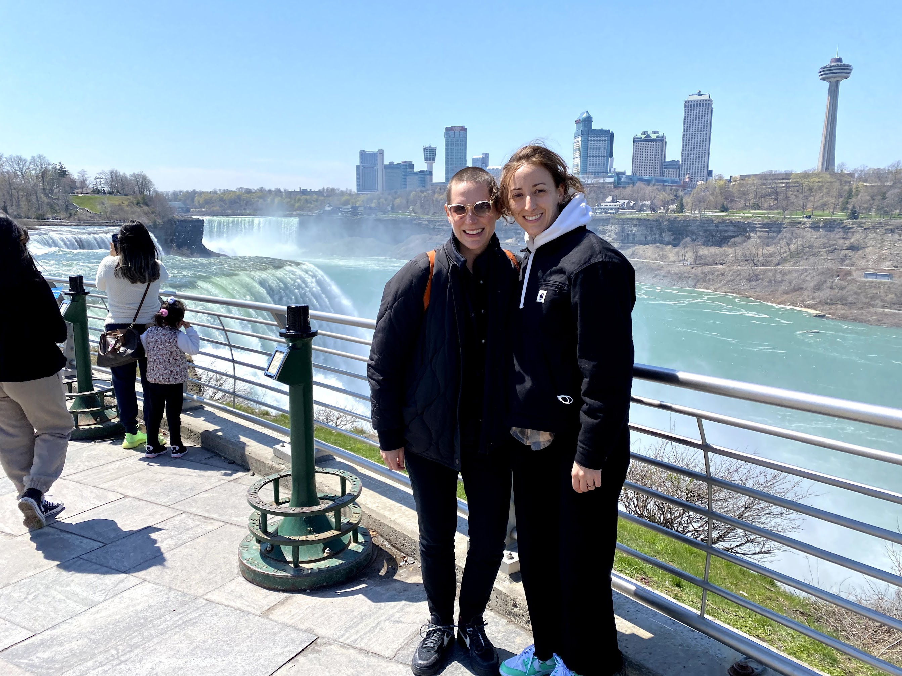
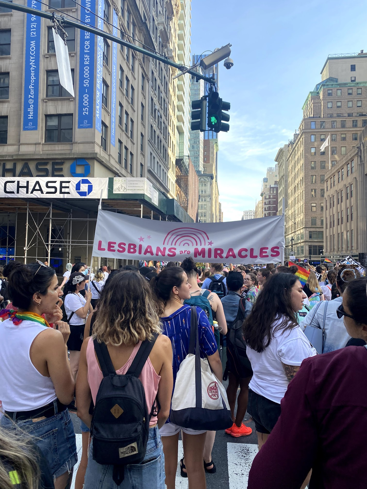
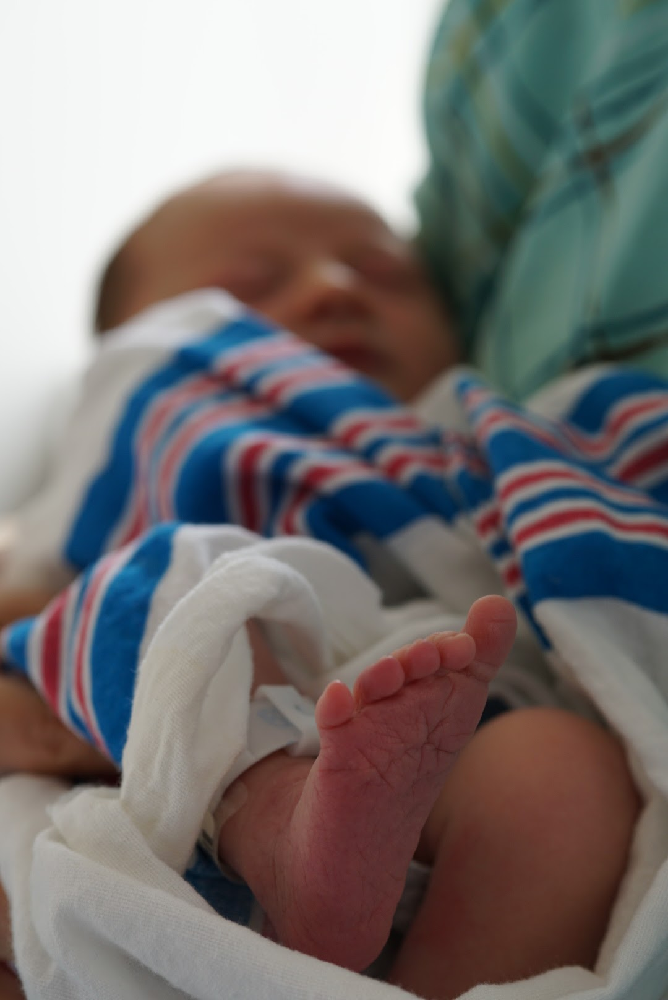
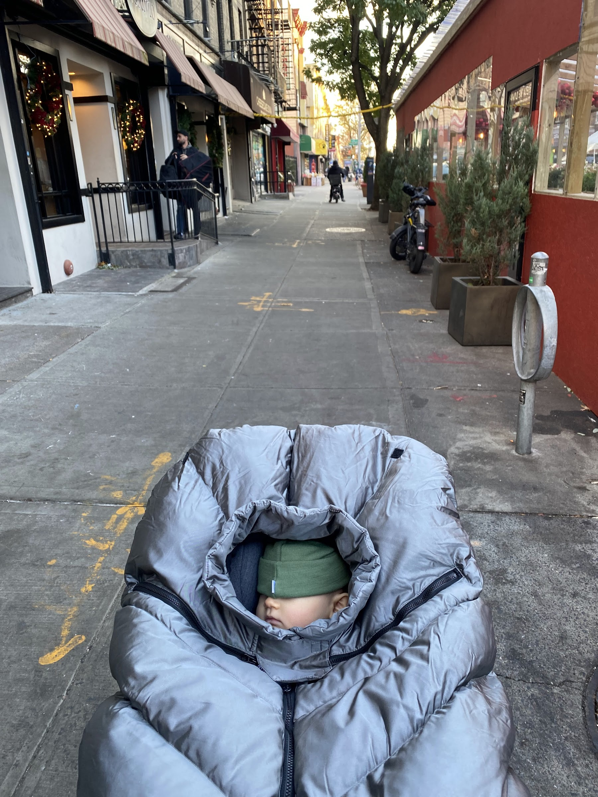
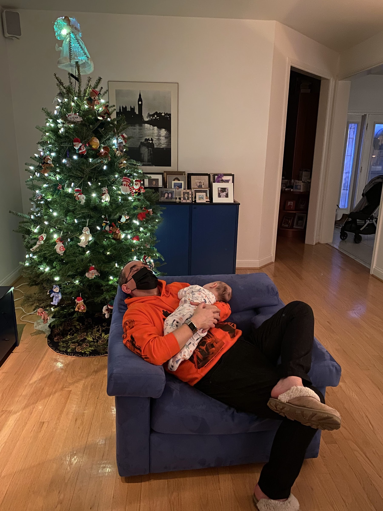

2021 was a year of seven beautiful babies born to friends and family, including the first addition to the Sandersario family (portmanteau for IRL/URL friends, not legal documents), Baby O, and one outdoor wedding (congrats Monica & Mike!)

The year began with much less fanfare than 2020, but with an undercurrent of anticipation for the newest family member already well on their way.

Ghost, our formerly-outdoor-but-now-solidly-indoor cat kept us entertained through the darkest hours of the winter as Carla slept more than usual and I kept myself occupied making [Detroit-style pizzas from scratch](https://www.kingarthurbaking.com/recipes/king-arthurs-detroit-style-pizza-recipe). I turned 30 and my sister-in-law helped me realize my dream of one day owning a pasta maker.

Countless loaves of quarantine bread were baked and consumed, and in March we had the joy of becoming aunts for the first time to Dana & Jon's delightful Baby A.

## 15 minutes of Canadian infamy

In April, after gratefully receiving both vaccine doses, Carla and I decided to pay my family in Toronto a visit. The quarantine hotel requirement for international air travelers was in effect so we thought we'd walk across the Rainbow Bridge at Niagara Falls instead...

Our travel day went almost exactly according to plan save for the CTV reporter who rushed us on the Canadian side. I dodged him, but Carla proudly told him and his camera exactly why we'd crossed the border on foot. [Her clip made the 6 o'clock news](https://toronto.ctvnews.ca/ontarians-skipping-hotel-quarantine-program-by-walking-across-canada-u-s-border-1.5400275) and we even received a few calls for our arrest via Twitter, this being 2021.

The rest of the spring/summer sped by: a couple of short visits to Rhode Island, Buffalo and Shelter Island, one baby shower in Prospect Park and a NYC Dyke March to remember (Carla was one of the most popular marchers with her crop top and, by then, massively pregnant belly.)

## Here he comes

We were sitting (emphasis on _sitting_) on the N train when Carla's water broke as we pulled into the 39th Ave. station in Queens, what the labour and delivery nurse later called Baby O's "New York baptism." We hopped off and frantically called Carla's doctor who advised us to calmly head home (yeah right), grab our bag and proceed to the hospital.

It was an otherwise quiet Saturday afternoon when we finally arrived at the delivery ward. Veronika, the nurse on shift when we were first admitted, assured us Carla would probably still be waiting for active labour to begin when she came back on shift ~24H later. Baby O had other plans: the next morning at 7:24am he was in our arms.

In the middle of the delivery (!) one of the nurses noticed my OCAD sweatpants and exclaimed "Canadians?!" to my utter bewilderment. And in the seconds after Baby O's birth, another nurse grabbed my phone and snapped what are now the most precious photos I possess. I've heard other parents describe the bond that is formed with the people who help bring your child into the world, but I couldn't stop marveling at the level of care we received. We are forever indebted to the team at NYU Langone.

## Learning to parent in a pandemic

The late summer/fall was a glorious jumble of diapers, long walks and discovering exactly what hour of the early morning my favorite podcasts drop while savouring my half of the night shift.

Despite the fully vaxxed summer in effect in NYC, having a newborn in many ways felt like being transported to day 0 of lockdown: fewer MTA trips, more walking and park hangs.

To end the year, we traveled to Toronto for Christmas and introduced the kid to one of the three branches of his family tree to everyone's delight. We cut our trip short due to Omicron, but we're so thankful for the time we had.

Thanks for reading! Wishing you a very happy holidays and a wonderful 2022 :^)

\- Alessia
