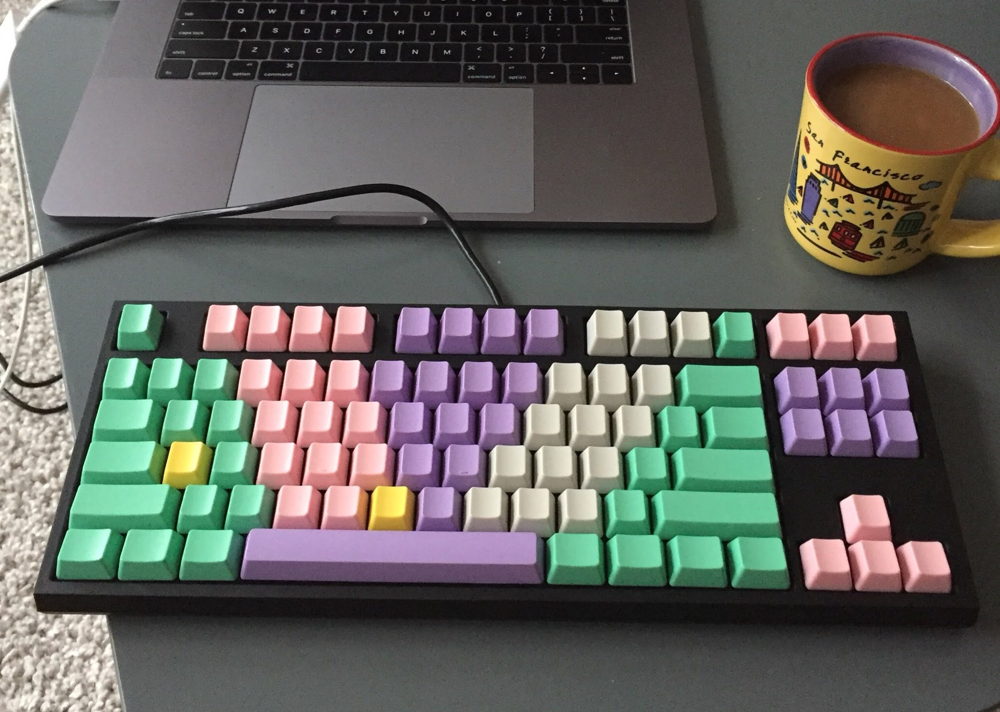
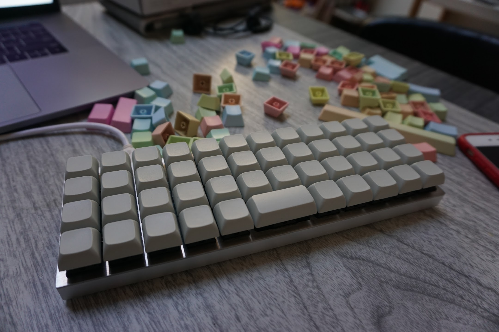
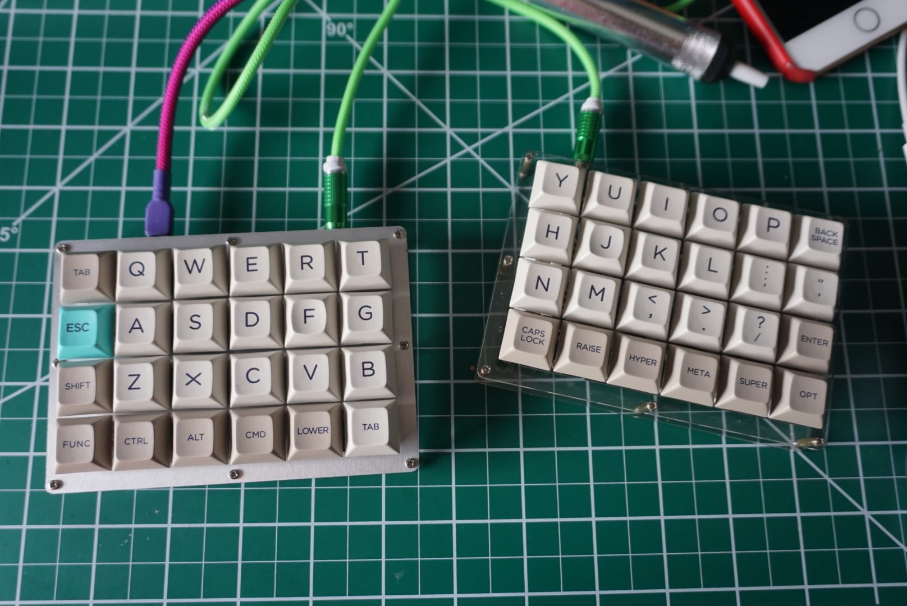

It started three years ago. A friend and coworker, Joshua Comeau, turned heads when he brought in the first mechanical keyboard our office had seen. If memory serves, it was a standard 87-key tenkeyless layout with Cherry MX Blue switches. But all anyone noticed were the keycaps.

I remember what it looked like, but didn't yet have the words to describe it. I was happily a standard issue MacBook keyboard user (pre-2015 redesign, RIP). I'd never typed on, let alone read a spec sheet for, a mechanical board. Josh and I sat beside each other, so I got to be the first to ask him the question I later heard him field a few times a week: _... but where are the letters?_

Josh had chosen a flashy custom pattern of multicolored, and crucially, _blank_ keycaps. Something about them was both endearing and an affront. They said: "I'm a confident touch typer who is making an aesthetic choice" and also "if you're not in the club, I am the functional equivalent of a gilded tray of marbles." I was mystified, which is as good an indication as any that I am about to become hooked.

---

I tried Josh's out a few times during pairing, Googled for a year and finally picked out a WASD 87-key, also with blank keycaps, though I went with the slightly quieter though still tacticle bump-y brown switches. I was already a confident typist, but still I hedged: I got my initials in gold as a visual anchor.

I loved it and used it every day for about a year and a half.

# Planck OLKB

# Levinson

