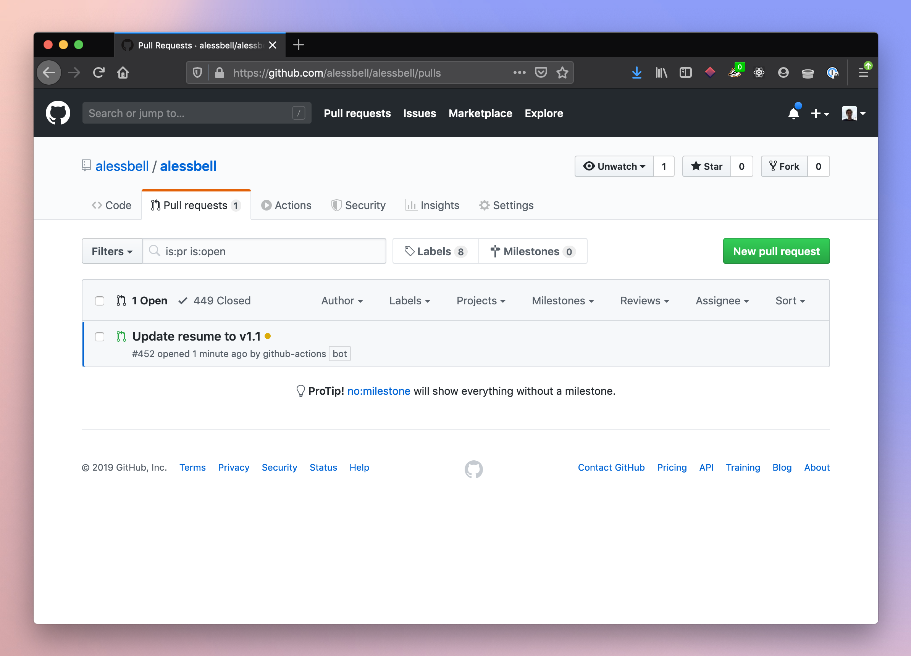

I avoid brand new tech until I have an itch to scratch: a small, self-contained problem that seems it might lend itself nicely to \$someTool. I'm usually unsure I'll be able to achieve what I have in mind. But _maybe..._

This time, the problem was something that had annoyed me for as long as I'd been employed: resumes. Not the fact of them, or even writing them, necessarily. Just **managing different versions**.

I was swimming in Dropbox folders with dozens of files saved in various formats; I needed to maintain multiple documents to preserve different iterations, and export PDFs for distribution. Version control was a nightmare.

## LaTeX and git to the Rescue

One day I happened upon [Daniel Cousineau](https://github.com/dcousineau)'s [`resume`](https://github.com/dcousineau/resume). Daniel was using a tool I'd heard of but never worked with called [LaTeX](https://www.latex-project.org/about/) (a system for generating documents, and not a particularly new one), along with GitHub releases to track his resume's evolution. It seemed promising.

I set up [`alessbell/resume`](https://github.com/alessbell/resume/), rewrote my resume as `resume.tex` and, back in June, released `v1.0` 🎉

## Wherefore Art GitHub Actions

Having a resume managed in GitHub was a _very_ welcome change, but there were still a few manual steps every time I wanted to cut a release:

1. **Draft a new release via GitHub UI.** Tag my commit and begin manually creating the release.
2. **Manually compile `resume.tex` and upload the PDF as a release asset.** GitHub automatically includes the source code in both zip and tarball formats, but I wanted to include a compiled `resume.pdf`, too. I'd run `pdflatex` locally and drag and drop the file, again via GitHub UI.
3. **Update the copy of `resume.pdf` in Gatsby's `/static` folder.** I'd take my new PDF and drag and drop it into my local copy of the [codebase for this website](https://github.com/alessbell/alessbell/), since I want [aless.co/resume.pdf](https://aless.co/resume.pdf) to always display the latest version. Then I'd manually open a PR.

Once I'd isolated the steps that were candidates for automation, I sketched out the ideal workflow: first, automating releases in `alessbell/resume`, then somehow pinging another repository when a new release was published (??), and finally, the other repository (this blog) would download `resume.pdf` from the latest release, commit it and open a PR... _maybe?_

I had no idea how feasible this all was, still knowing little to nothing about the GitHub Actions API. But automating even one step would be a win!

## Spoiler Alert

tl;dr my ideal workflow was possible, so I built it 🐙💜

If you'd like to browse the code, steps 1 and 2 are achieved by the [main workflow in `alessbell/resume`](https://github.com/alessbell/resume/blob/master/.github/workflows/main.yml). Step 3 is handled by actions in this blog's repository, namely [`/commit-resume`](https://github.com/alessbell/alessbell/blob/main/commit-resume/entrypoint.sh). For a walk-through of the code, keep reading 😎



### 1. Compile the PDF and Automate Releases

I figured automating the release part would be easy—_surely there's already an action for that_—but I wasn't so sure about compiling the LaTeX to PDF for inclusion in the release.

Delightfully, both steps turned out to be trivial to implement. I found off-the-shelf actions for both: [`xu-cheng/latex-action`](https://github.com/xu-cheng/latex-action) for compiling my LaTeX to PDF and [`softprops/action-gh-release`](https://github.com/softprops/action-gh-release) for creating the GitHub release with the compiled PDF from the previous step attached as an asset.

My first `.github/workflows/main.yml` looked like this:

```yaml
name: Publish new release of resume
on:
  push:
    tags:
      - 'v*.*'
jobs:
  build:
    runs-on: ubuntu-latest
    steps:
      - name: Checkout
        uses: actions/checkout@master
      - name: Compile LaTeX document
        uses: xu-cheng/latex-action@master
        with:
          root_file: resume.tex
      - name: Release
        uses: softprops/action-gh-release@v1
        with:
          files: resume.pdf
        env:
          GITHUB_TOKEN: ${{ secrets.GITHUB_TOKEN }}
```

This workflow runs on any `push` event targeting tags matching the glob pattern `v*.*` ([docs](https://help.github.com/en/articles/workflow-syntax-for-github-actions#onpushpull_requestbranchestags)). The first step, [`actions/checkout`](https://github.com/actions/checkout), checks out the repository to the current GitHub workspace so that the workflow can access the contents of your repository.

After that, I can pass the next step the name of my file, `resume.tex`, and the subsequent step can directly access the compiled `resume.pdf` from the previous one. In order to author a release, I need to pass in a `GITHUB_TOKEN`; luckily GitHub already makes certain [environment variables](https://help.github.com/en/articles/virtual-environments-for-github-actions#github_token-secret) available.

### 2. Ping Another Repository

In order to keep the version of my resume displayed on this website up-to-date, I'd need a way to kick off a new workflow each time I published `alessbell/resume`.

Luckily, such an event exists: [`repository_dispatch`](https://developer.github.com/v3/repos/#create-a-repository-dispatch-event) triggers a webhook event "when you want to trigger a GitHub Actions workflow for activity that happens outside of GitHub," or, in this case, in a different repository's action. A simple curl request with the correct auth token, headers and body does the trick.

This is the [whole bash script](https://github.com/alessbell/resume/blob/master/ping-repo/entrypoint.sh) from `alessbell/resume/ping-repo`:

```bash
#!/bin/bash

main() {
  curl -XPOST -H "Accept: application/vnd.github.everest-preview+json" \
  -H "Content-Type: application/json" \
  -H "Authorization: token ${GITHUB_TOKEN}" \
  "https://api.github.com/repos/${REPO}/dispatches" \
  --data '{"event_type": "update_resume"}'
}

main
```

There were two small caveats here. **First**, because this POST request is being dispatched for a repository other than the one from the action's execution context, I needed a [personal access token](https://help.github.com/en/articles/creating-a-personal-access-token-for-the-command-line) with `repository` scope set as a [secret on the repository](https://help.github.com/en/articles/virtual-environments-for-github-actions#creating-and-using-secrets-encrypted-variables). I stored my secret as `PA_TOKEN` and passed it in the way I had the others:

```yml
- name: Pings repo
  uses: ./ping-repo
  env:
    GITHUB_TOKEN: ${{ secrets.PA_TOKEN }}
    REPO: alessbell/alessbell
```

**Second**, certain events, e.g. `push` will run on any branch unless the scope is narrowed by specifying a certain branch or tag. When I was testing this `repository_dispatch` event, however, nothing was happening despite having pushed a workflow to a branch in my blog's repository listening for this exact dispatch event. It wasn't until I pushed the blog's workflow config to master that I saw it spring to life, activated by my Postman request to the `/dispatches` endpoint.

### 3. Download New PDF, Open PR

This final step felt like a stretch goal, but I ended up knocking it out on a train ride from Rhode Island to NYC. The first part is fetching the latest version of `alessbell/resume`, and GitHub's API has a dedicated endpoint for retrieving information about a repository's latest release:

```bash
RELEASES_URL=https://api.github.com/repos/alessbell/resume/releases/latest

RES=$(curl -sSL -H "${AUTH_HEADER}" -H "${HEADER}" --user "${GITHUB_ACTOR}" -X GET ${RELEASES_URL})
VERSION=$(echo "${RES}" | jq --raw-output '.tag_name')
PDF_URL="https://github.com/alessbell/resume/releases/download/${VERSION}/resume.pdf"

# download resume.pdf and save in /static/resume.pdf
curl -L0 "${PDF_URL}" --output ./static/resume.pdf
```

Once I had the file downloaded, I'd just need to commit it and open a PR. This time, I'd try to use a pre-existing action with a bit less luck: I wasn't able to integrate [`vsoch/pull-request-action`](https://github.com/marketplace/actions/pull-request-on-branch-push) directly (I'll be the first to say it could have been user error: when I'm out of my comfort zone, I need to be able to tinker with the source), but reading its source taught me a lot about how to write a similar action that would work for my case.

I wound up with [~90 lines of bash](https://github.com/alessbell/alessbell/blob/main/commit-resume/entrypoint.sh) and successfully used [`jq`](https://stedolan.github.io/jq/) for the first time. There was plenty of trial and error along the way, but once I plugged it all together, it Just Worked <3

---

Writing bash and yaml isn't part of my day job, but it was a lot of fun once I got started; tinkering with GitHub Actions provided the perfect excuse to learn something new while scratching an itch.

Is there a workflow you're thinking about automating? I'd be curious to hear about it -- you can ping me on twitter at [@alessbell](https://twitter.com/alessbell) or email me at [web[at]bellisar.io](mailto:web@bellisar.io).
