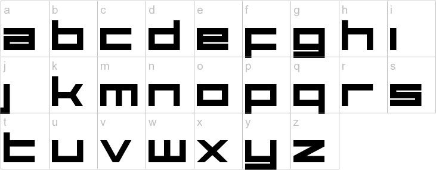
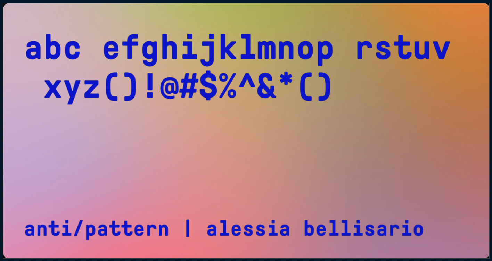
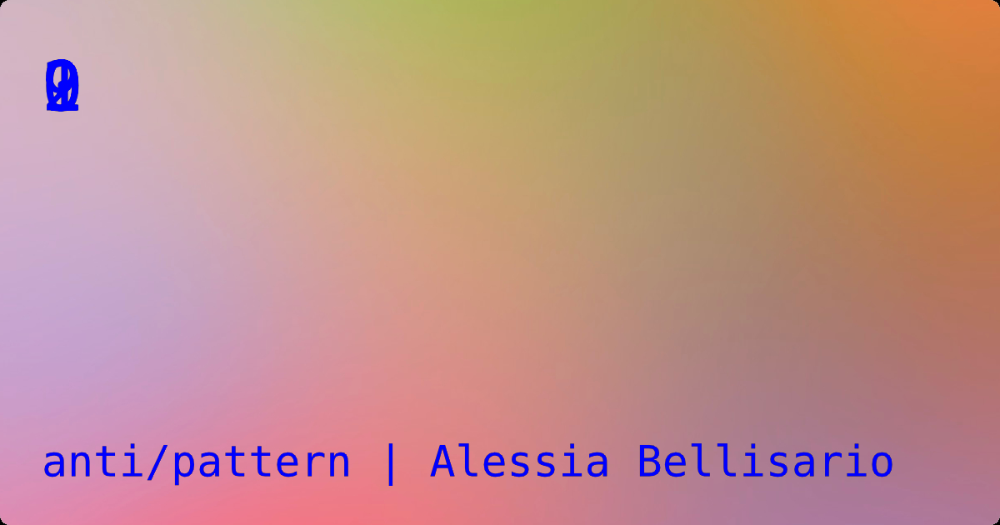

> **Law of the Instrument**: "I suppose it is tempting, if the only tool you have is a hammer, to treat everything as if it were a nail." - Abraham Maslow, 1966


## The Problem

In August, I was looking to generate some [Open Graph](https://ogp.me/) images for blog posts I was publishing to this very Gatsby site (that is, the photos that appear when one of my posts is shared in most social apps). The idea is simple: **take each post's metadata** and **create images containing some text** (title, author, site name) at build time.

The only catch: I wanted to supply a **custom font**, and if that wasn't possible, at least use a **monospace font** (for the personal `#brand`). A custom background image would be nice. I couldn't find an existing solution that met these requirements, so I set out to build my own. Some interesting constraints led me to Rust and WebAssembly--more on this in a minute.

I also admittedly found myself holding a Rust-and-Wasm-shaped hammer, having recently worked with both technologies to build an interactive web app at [RC](https://recurse.com) :)

<!-- This is the story of how I wound up writing two small packages to accomplish my goal: [`wasm-twitter-card`](https://www.npmjs.com/package/wasm-twitter-card) where I use `wasm-bindgen` to write idiomatic Rust that handles text layout and maps to an idiomatic JavaScript function I call from [`gatsby-remark-twitter-cards`](https://www.npmjs.com/package/gatsby-remark-twitter-cards), a small plugin that takes blog post metadata, passes it to my Wasm lib, and saves the resulting images. Ta da✨ -->

## Why WebAssembly?

The prior art for Open Graph image generator plugins in the Gatsby space consists mainly of [`gatsby-remark-social-cards`](https://www.npmjs.com/package/gatsby-remark-social-cards). I came across some [other](https://github.com/sw-yx/swyxdotio/tree/master/screenshot-plugin) [approaches](https://lannonbr.com/blog/2019-11-10-og-images/) that involve writing bespoke code to achieve more complex layouts by rendering some HTML on the server and using Puppeteer to take screenshots, but these felt too heavy-handed for my use case.

After taking a look through the README, `gatsby-remark-social-cards` fit all my criteria **except the font** (it only supports DejaVuSansCondensed). This is for a purely practical reason: the main library for image processing in Node.js _with zero native dependencies_ is [`jimp`](https://www.npmjs.com/package/jimp). And `jimp` only supports **bitmap fonts**.

## Bitmap Fonts



Bitmap fonts are comprised of a matrix of pixels, so they can't be scaled or styled like vector/"scalable" fonts (think TTF/OTF). In practice, this means a standalone font file is needed for every combination of font size, color and weight! Indeed, the plugin I was examining had a `/fonts` folder containing **twenty different `.fnt` files** for a single typeface styled twenty different ways 😲

### Aside: Netlify Build Image

I generate this site with Netlify and the build image includes native dependencies [`graphicsmagick`](https://github.com/netlify/build-image/blob/xenial/Dockerfile#L59) and [`imagemagick`](https://github.com/netlify/build-image/blob/xenial/Dockerfile#L63), so I could have used a Node library like `gm` to render text in the vector font of my choice. I didn't want one of my Gatsby plugin's dependencies to require these native dependencies, however, even if it would work out of the box for me and other Netlify users.

I was back to square one: `jimp` + bitmap fonts. The thought of having to download a program to generate a bitmap font for every style I wanted to try was deeply unappealing, not to mention the lack of configurability for users of my plugin, the problem that set me down this path in the first place... There had to be a better way™️ Which brings me back to Rust+Wasm.

## Step 1: Write Rust

I've been learning Rust off and on over the past year, and while I'm familiar with many parts of the language, though still a beginner, I knew exactly nothing about low level text layout when starting this project. I picked a _crate_ (synonymous with "library" or "package" in other languages) that seemed to handle my use case called [`fonterator`](https://docs.rs/fonterator/0.6.0/fonterator/), grabbed the example code from the docs and used [this template](https://github.com/rustwasm/wasm-pack-template) to spin up a Rust + Wasm project with `wasm-pack`.

The `fonterator` demo uses the library to render some text in English and Korean and finally calls:

```rust
std::fs::write("out.png", out_data).expect("Failed to save image");
```

`std::fs::write` is a function in the Rust standard library that writes to a file, as you'd expect, and saved `out.png` to my machine when I ran the Rust program directly 🎉

The next step was to annotate my Rust function with `#[wasm_bindgen]`, compile my Rust to WebAssembly and call the function via generated JavaScript interface from my Node script. Nothing else about my code was changing—if all went well, I'd still get my `out.png`! Not so fast:

```
Error: operation not supported on wasm yet
```

Oops. When compiling Rust for the `wasm32-unknown-unknown` target, the Rust standard library can only assume the WebAssembly instruction set, and since Wasm provides no means of doing I/O or saving files, these stubs are left to return errors in the standard library.

The Rust and WebAssembly book has a helpful section on how to add Wasm support to a general-purpose Rust crate. The first tip: [avoid performing I/O directly](https://rustwasm.github.io/book/reference/add-wasm-support-to-crate.html#avoid-performing-io-directly) 😀

> Why is the target called `wasm32-unknown-unknown`? `wasm32` means the address space is 32-bits large, the first `unknown` refers to the system the code is compiling on, and the second refers to the system being targeted: `unknown-unknown` implies "compile on almost any machine, run on almost any machine."

## Bytes In, Bytes Out

Since I can't perform I/O from my Rust-generated Wasm, I'd have to pass in the font as a `Uint8Array` and return a `Uint8Array` buffer of rendered text. The Rust API I settled on looks like this:

```rust
#[wasm_bindgen]
pub fn generate_text(
    title: &str,
    author: &str,
    title_font_size: i32,
    subtitle_font_size: i32,
    rgb: JsValue,
    font_style: &str,
    font_file: Uint8Array,
) -> Vec<u8> {
  // ...
}
```

`generate_text` takes the strings to be rendered, some config—font sizes, RGB value for text color and either a string to set the font style using preselected open source fonts or a TTF font file—lays out the text, draws the glyphs to a dynamic image backed by a buffer of RGBA pixels and returns a `Vec<u8>` buffer of pixel data.

This allowed me to continue using `jimp`, an excellent library, in my Gatsby plugin's Node script. I was amazed at how easy it was to put the pieces together: I initialized a Jimp image from the user's provided image or created one consisting of a solid color via provided hex code, then called my Wasm function to render the text as a buffer of pixel data I could read into a second Jimp image. All I had to do was composite the latter over the former, a one-liner with `jimp`, and voilà.


The first time I saw my Open Graph image with text generated by Rust+Wasm felt like magic 🤘

```js
const twitterCard = require('wasm-twitter-card');

// utility functions for reading/initializing jimp images

module.exports = ({ markdownNode }, config) => {
  // format post title/author from markdownNode

  const fontToUint8Array = fs.readFileSync(
    require.resolve(config.fontFile),
    null
  );
  const buffer = twitterCard.generate_text(
    post.title,
    // ...
    fontToUint8Array
  );
  return Promise.all([generateBackground(background), writeTextToCard(buffer)])
    .then(([base, text]) => base.composite(text, 0, 0))
    .then(image =>
      image
        .writeAsync(output)
        .then(() => console.log('Generated Twitter Card: ', output))
        .catch(err => err)
    )
    .catch(console.error);
};
```

## Trial and Error

I did this, and fonterator can accept a TTF/OTF font. First I tried this directly in Rust:




## Takeaways

- solving a problem with constraints is fun :)
- fonts are pretty incredible: there is plenty of complexity when it comes to laying out/rendering text. I still don't know what the fonterator issue is, but I'm curious...
- Rust is a vast language that introduced me to many new concepts (ownership model of memory management). There are still so many parts of the language I have yet to grasp (lifetimes! [turbo fish!](https://turbo.fish/)) You don't need to understand every last Rust feature/API to start writing it, just start with the parts you need.

---

- js_sys?? Uint8Array.to_vec https://rustwasm.github.io/wasm-bindgen/api/js_sys/struct.Uint8Array.html#method.to_vec
- fs.readFileSync for reading a file to a buffer https://nodejs.org/api/fs.html#fs_fs_readfilesync_path_options
- glyph_brush https://github.com/alexheretic/glyph-brush
- how to pass in RGB values
- how to pass in a font when you can't use a dynamic path to a file: you turn the file into a Uint8Array and pass that
- `wasm-pack` to publish NPM package
