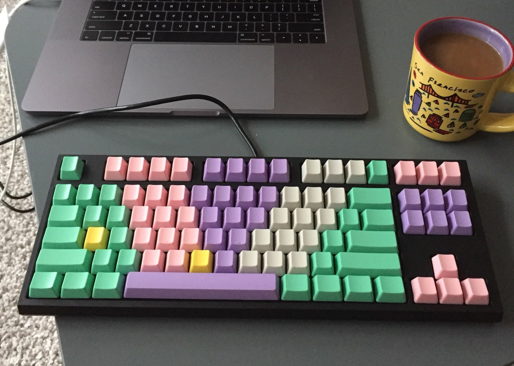
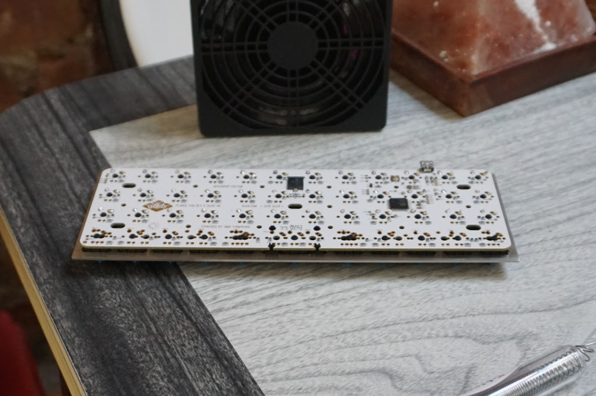
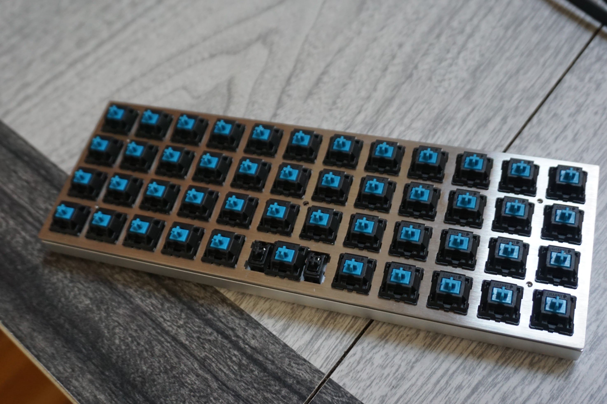

A few years ago, a friend and coworker came in to work one day with a mechanical keyboard under his arm. If memory serves, it was a standard 87-key layout with Cherry MX Blue switches, but all anyone noticed were the keycaps.

I was happily a standard issue MacBook keyboard user at the time (pre-2015 redesign, RIP). I'd never typed on anything else. Glancing over at his desk as he set it down, I was the first to pose the question I'd later hear him field a few times a week: _...but where are the letters?_

He'd chosen a flashy pattern of multicoloured, and crucially, _blank_ keycaps. Something about them was both endearing and an affront. They said: "I'm a confident touch typer making a playful aesthetic choice," and also "if you're not in the club, I am the functional equivalent of a gilded tray of marbles." I was mystified.

## WASD

My first mechanical keybord was one I would purchase preassembled: a WASD 87-key "v2" build. It, not coincidentally, also had blank keycaps, though I went with the slightly quieter but still satisfyingly tacticle Cherry MX Brown switches. I was a fast typist, but I found myself hedging: I got my initials in highlighter yellow as a visual anchor 💛

I loved it and used it every day for almost two years. And then I saw the Planck.

## Planck OLKB

The Planck looked more like a practical joke than a productivity tool the first time I saw it. Its petite size (40% the size of a typical keyboard) and grid layout ("ortholinear") give the Planck both a strange and satisfyingly symmetrical look.

It was so fundamentally different from every keyboard I'd ever seen that at first I was genuinely confused as to whether it was some kind of art project, or if people actually used it as their daily keyboard. Frustratingly, this question seemed to have an answer so obvious that no one had wasted their time posing or answering it online, until an internet commenter somewhere assured, no, seriously, they use their Planck at work!

If you're still wondering about that maybe-fake-sounding term "ortholinear," here's a bit of history from [OLKB](https://olkb.com/reference/primer):

> Ortholinear is a semi-made-up word that was originally coined (to my knowledge) by TypeMatrix as "ortho-linear" - this term got concatenated, became popular among the keyboard community, and eventually became the banner for a keyboard company!

The company OLKB (**O**rtho**L**inear**K**ey**B**oards) sells them in ready-to-build kits. I got mine on [Drop](https://drop.com/buy/planck-mechanical-keyboard) (formerly Massdrop), and it arrived in a handful of pieces: a PCB (Printed Circuit Board), a single steel plate with holes where the switches would be mounted, an alumninum case to house the finished product, a humble USB cable and bag of keycaps.

I knew I'd have to solder some parts together, and I'd never done it before/was convinced I didn't know anyone who had. (In the past I'd played around with little hardware projects, buying parts on Adafruit, but was always careful that no soldering was required.) After a bit of research, I picked up:

- the ["Blink" Learn to Solder Kit](https://www.amazon.com/gp/product/B017S00DJ2/ref=ppx_yo_dt_b_asin_title_o07_s00?ie=UTF8&psc=1)
- a pair of [micro wire cutters](https://www.amazon.com/gp/product/B00FZPDG1K/ref=ppx_yo_dt_b_asin_title_o06_s00?ie=UTF8&psc=1)
- this [fan](https://www.amazon.com/gp/product/B0711LFYJ1/ref=ppx_yo_dt_b_asin_title_o09_s00?ie=UTF8&psc=1) to remove solder fumes
- a now-discontinued $17 soldering iron kit that came with an iron, some solder, and a carrying case

## Learn To Solder

I found the learn to solder kit to be very approachable: it comes with a single small PCB, 3x LEDs, 3x resistors, 3x push button switches and a 3V coin battery and battery holder. I watched a few YouTube videos of people soldering and came across the great [Adafruit Guide to Excellent Soldering](https://learn.adafruit.com/adafruit-guide-excellent-soldering/common-problems) before I gave it a go. In about ten minutes, I had turned a pile of loose bits of metal and plastic into a tidy row of buttons hooked up to a battery that could summon light from LEDs 🤯

My first attempt at soldering was passable! I did have one joint I needed to fiddle with a bit, but more importantly, I was becoming comfortable wielding an iron without the pressure of a "real" project.

I was ready to try my luck with the Planck PCB. Something I didn't fully appreciate at the time is that it comes with all the components that _aren't_ switches **already soldered**: resistors, diodes and a microcontroller. And like most boards compatible with Cherry MX-style switches, the Planck's switches are **plate mounted**, meaning the switch first snaps onto a metal or plastic plate to position it securely before its pins are soldered to the PCB below.

There are two main layouts for the Planck: **grid**, consisting of 48 keys (4x12), and **MIT**, consisting of 47 keys (a similar grid, except a single switch is used for the spacebar in the bottom row with an optional stabilizer bar). As I'd read online, the best strategy for soldering plate mounted switches is to pop in the four corner switches, solder those, and then proceed to solder the rest of the board.

I'd gone with the MIT layout, so I had 47 x 2 pins per switch = 94 pins to solder (!). This sounded like a lot, but once I got into a flow state (pun regrettably intended), I blinked and was suddenly done.

In my research, I came across several mentions of **flashing** the board, or loading new firmware instructions ("flashing" from "flash memory"), but I was able to avoid this step for now as the Planck comes pre-flashed with a [well-designed standard layout](https://qmk.fm/keyboards/planck/).

All that was left was the task of re-learning how to type! I'm only partially kidding: the layout is intuitive once you're used to it, but to compensate for the fact of so few _physical_ keys, the Planck has three layers of "keys" in software embedded on the board, also known as **firmware**. Think: key combinations to type a single special character or number. It's not for everyone, but for some reason it grew on me.

At this point, you may be simply wondering: _why_? Some claim ortholinear boards are more ergonomic, but there are no studies I'm aware of that have established this claim. finish conclusion...

<!-- Since becoming acclimatized to the Planck, I'm able to switch between staggered and ortholinear boards with brief intermittent periods of slower-than-normal typing speeds... it's a weird kind of kinesthetic bilingualism that I earned mostly out of morbid fascination. -->

