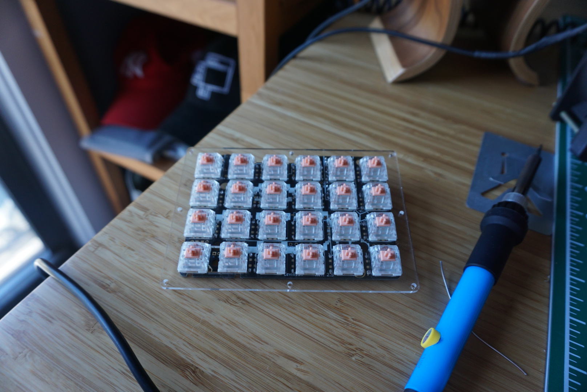

Last time on _How to Build a Keyboard_ we learned what "ortholinear" means, covered the basics of assembling a Planck and left off on an exciting and aspirational note: we were about to build a Levinson!

## WTF is a Levinson

After building my Planck, I was thrilled just to have gotten all 94 pins properly soldered, each of my 47 switches firing reliably (and noisily). Using a keyboard every day that I'd had some part in assembling was a previously unimaginable feat, but the thrill wore off quickly.

I found myself wondering about all the other parts of a keyboard that had come pre-soldered with the Planck. How difficult would it be to assemble a hardware puzzle with a few different kinds of components beyond just switches? The Levinson was my excuse to put myself to the test.

In the course of rummaging through keyboard blogs and websites, I had come upon the keyboard parts retailer [keeb.io](https://keeb.io). While I had seen "split boards" in their final, assembled form before ("split" referring to the fact that these keyboards have two separate halves, allowing both hands to remain shoulder-width apart while typing, a more ergonomic position some believe.)

