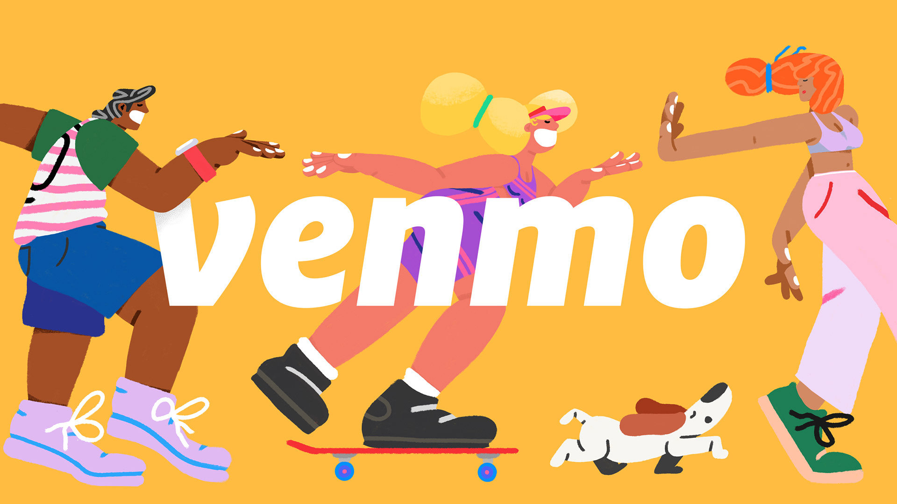

Job searches are curious, unpredictable beasts.

The last time I started a new job, I couldn't have imagined what it would have in store for me. I was joining [Breather](https://breather.com) in Montréal which involved a winter move from my home in Toronto. Arriving January 2, 2015 with two suitcases, I had no idea the coldest February in the city's recorded history was awaiting me the following month.

At the tail end of 2014, I briefly worked at an agency in Toronto, one I felt lucky to join after stints at two tiny startups straight out of a bootcamp. I wrote quite a few hand-crafted cover letters, sure, but I was certainly not above slinging LinkedIn applications to any company that seemed to be hiring juniors ("spray and pray") and receiving my fair share of rejections: the companies who just ghost, the soulless form letters and the slightly more humane notes, however vague. It's true that you **just need one yes**, but there's no telling how long it might take to get there. When the agency offered me a junior fullstack role, I was thrilled.

But this post isn't about landing an entry-level job: after two weeks at the agency, I got the call from Breather and jumped ship. After almost 5.5 years at Breather across two HQs, it was time to go searching for my next yes. This post is about that job search that ultimately concluded when I accepted a Senior Front End role at Venmo 🎉

Over five years and two cities later,

<!--  -->

## On-Sites + Offers

<table>
  <tbody>
    <tr style="background-color: #B6D7A8; border-bottom: 2px solid #38761D;">
      <th>Company</th>
      <th># of Interviews</th>
      <th>Offer</th>
    </tr>
    <tr>
      <td>Venmo/PayPal</td>
      <td>3 (recruiter, coding, EM) + onsite</td>
      <td>✅</td>
    </tr>
    <tr>
      <td>👩‍💻</td>
      <td>1 (recruiter) + take-home + onsite</td>
      <td>✅</td>
    </tr>
    <tr>
      <td>🎒</td>
      <td>2 (recruiter, coding) + onsite</td>
      <td>✅</td>
    </tr>
    <tr>
      <td>✏️</td>
      <td>2 (recruiter, coding) + onsite</td>
      <td>✅</td>
    </tr>
    <tr>
      <td>📰</td>
      <td>2 (recruiter, coding) + onsite</td>
      <td>✅</td>
    </tr>
    <tr>
      <td>🧢</td>
      <td>2 (recruiter, coding) + onsite</td>
      <td>❄️</td>
    </tr>
    <tr>
      <td>👾</td>
      <td>1 (EM) + take-home + onsite</td>
      <td>❄️</td>
    </tr>
  </tbody>
</table>
