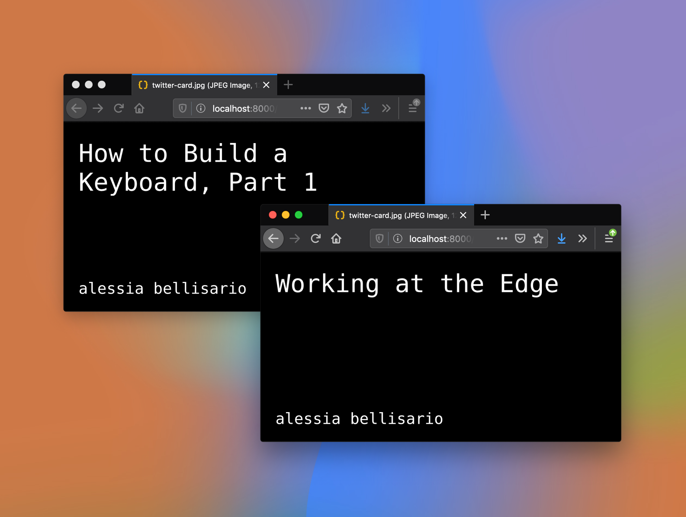
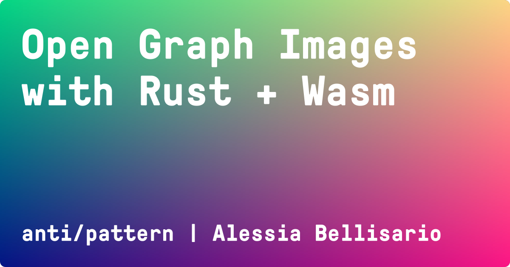

> **Law of the Instrument**: "I suppose it is tempting, if the only tool you have is a hammer, to treat everything as if it were a nail." - Abraham Maslow, 1966



I began learning Rust almost a year ago. I was inspired to pick up The Rust Book after I found myself in the audience of [a talk](/working-at-the-edge) on [`wasm-bindgen`](https://rustwasm.github.io/docs/wasm-bindgen/) and discovered I could build things with Rust that were relevant to me, a person who builds for the web. At the Recurse Center in April of last year, I used `wasm-bindgen` to build an interactive web app for making generative art with Rust + Wasm + JS. In other words, I had my first taste of what's possible with WebAssembly.

## The Problem

This is the tale of but one solution to a seemingly trivial problem: I wanted to generate some JPGs for my Gatsby blog posts' [Open Graph](https://ogp.me/) images that appear when a post is shared in most social apps. This would involve **taking each post's metadata** and **creating images containing some text (title, author, site name) at build time**.

I wanted to **use a custom font**, but if that wasn't possible, at the very least I wanted a monospace font (for the personal `#brand`). I couldn't find an existing solution that met either of these requirements, so I set out to build my own.

Some interesting constraints led me toward Rust and WebAssembly, but I was also holding a Rust-and-Wasm-shaped hammer. In the end, I wrote two small packages to accomplish my goal: [`wasm-twitter-card`](https://www.npmjs.com/package/wasm-twitter-card) wherein I use `wasm-bindgen` to write idiomatic Rust that handles text layout and automatically maps to a generated idiomatic JS function I call from [`gatsby-remark-twitter-cards`](https://www.npmjs.com/package/gatsby-remark-twitter-cards), a small plugin that takes blog post metadata, passes it to my Wasm lib, and generates and saves the resulting images. Ta da✨



## Why Wasm?

At the time of my initial investigation, the prior art for Open Graph image generator plugins in the Gatsby space consisted of [`gatsby-remark-social-cards`](https://www.npmjs.com/package/gatsby-remark-social-cards) (I'd later come across some [other](https://github.com/sw-yx/swyxdotio/tree/master/screenshot-plugin) [approaches](https://lannonbr.com/blog/2019-11-10-og-images/)).

After taking a look through the README, `gatsby-remark-social-cards` fit all my criteria _except_ the font (it only supports DejaVuSansCondensed 😕). This is for a practical reason: the main library for image processing in Node.js **with zero native dependencies** is [`jimp`](https://www.npmjs.com/package/jimp)—indeed, the lib used under the hood in the plugin I was examining. And `jimp` only supports bitmap fonts.

While this limitation wasn't ideal, I decided to stick with jimp. Why? While I build my site with Netlify whose build image includes [`graphicsmagick`](https://github.com/netlify/build-image/blob/xenial/Dockerfile#L59) and [`imagemagick`](https://github.com/netlify/build-image/blob/xenial/Dockerfile#L63), I didn't want one of my plugin's dependencies to require any native deps, even if it would still work out of the box for Netlify users. Which turns us to the question:

## Bitmap Fonts??

What are bitmap fonts? I didn't want to generate one for every font I wanted to try.

---

- starting out, bitmap fonts??
- different targets: https://stackoverflow.com/questions/53304832/loading-a-file-from-wasm aka can't save to the file system from wasm
- wasm-bindgen?? https://hacks.mozilla.org/2018/04/javascript-to-rust-and-back-again-a-wasm-bindgen-tale/
- js_sys?? Uint8Array.to_vec https://rustwasm.github.io/wasm-bindgen/api/js_sys/struct.Uint8Array.html#method.to_vec
- fs.readFileSync for reading a file to a buffer https://nodejs.org/api/fs.html#fs_fs_readfilesync_path_options
- glyph_brush https://github.com/alexheretic/glyph-brush
- can I make something with Wasm?
- buffers??? how to return a bunch of pixels?
- base64??
- now how to add a background image??
- how to pass in RGB values
- how to pass in a font when you can't use a dynamic path to a file: you turn the file into a Uint8Array and pass that
- `wasm-pack` to publish NPM package

What did I learn:

- fonts are pretty incredible: there is plenty of complexity when it comes to laying out/rendering text... just as Raph Levien
- Rust is a vast language that introduces new concepts for many developers (ownership model of memory management), and that's great. You don't need to understand every Rust API to start writing it, just start with the parts you need and get building.

```bash
error[E0277]: the trait bound `(i32, i32, i32): wasm_bindgen::convert::traits::FromWasmAbi` is not satisfied
--> src/lib.rs:13:1
|
13 | #[wasm_bindgen]
| ^^^^^^^^^^^^^^^ the trait `wasm_bindgen::convert::traits::FromWasmAbi` is not implemented for `(i32, i32, i32)`

error: aborting due to previous error
```
