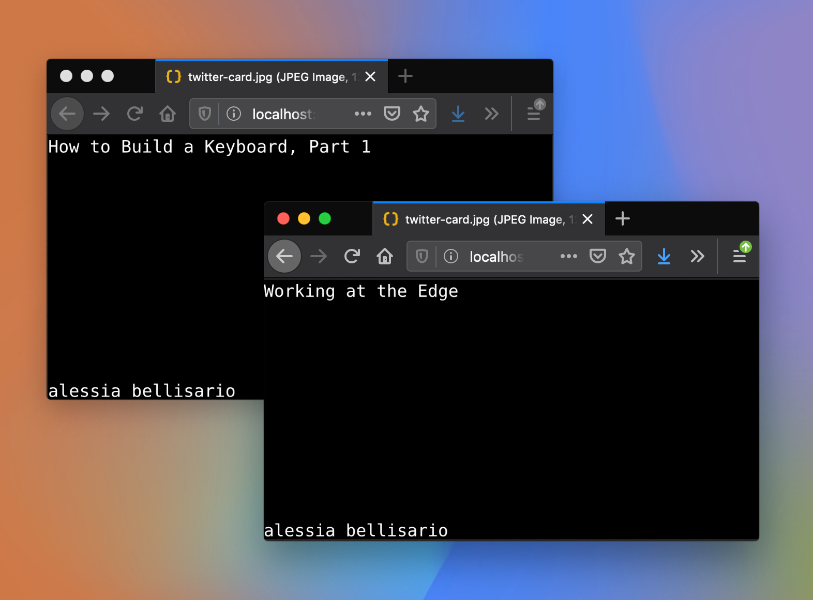

Say you want to start a blog.

Say you want to start a blog, and you _also_ manage to write your first blog post! Congrats. Yoou want to get the word out, so you head over to Twitter and start banging out a tweet. You hit send.

The story of making `gatsby-remark-twitter-cards`: I wanted a simple plugin to generate twitter card images, and found the existing solution to be alllmost what I wanted.



Upon closer inspection I didn't like the existing font choices, and the only way to change the font would be to fork the library and create my own bitmap fonts.

- Isn't this possible in Node.js? Well, not really: there's jimp which works with bitmap fonts, and I could use imagemagick but that would require installing more dependencies/having more complicated build steps, and I just wanted to use Netlify...
- Recurse Center: I learned about Rust + Wasm, but I built something purely for fun. This time I was trying to solve a very specific problem.
- starting out, bitmap fonts??
- different targets: https://stackoverflow.com/questions/53304832/loading-a-file-from-wasm aka can't save to the file system from wasm
- wasm-bindgen?? https://hacks.mozilla.org/2018/04/javascript-to-rust-and-back-again-a-wasm-bindgen-tale/
- js_sys?? Uint8Array.to_vec https://rustwasm.github.io/wasm-bindgen/api/js_sys/struct.Uint8Array.html#method.to_vec
- fs.readFileSync for reading a file to a buffer https://nodejs.org/api/fs.html#fs_fs_readfilesync_path_options
- glyph_brush https://github.com/alexheretic/glyph-brush
- can I make something with Wasm?
- buffers??? how to return a bunch of pixels?
- base64??
- WOO it's working
- now how to add a background image??
- how to pass in RGB values
- how to pass in a font when you can't use a dynamic path to a file: you turn the file into a Uint8Array and pass that

What did I learn:

- fonts are pretty incredible: there is plenty of complexity when it comes to laying out/rendering text... just as Raph Levien
- Rust is a vast language that introduces new concepts for many developers (ownership model of memory management), and that's great. You don't need to understand every Rust API to start writing it, just start with the parts you need and get building.

```rust
pub fn generate_text(title: &str, author: &str, title_font_size: i32, rgb: (i32, i32, i32)) -> Vec<u8> {
  const SUBTITLE_FONT_SIZE: f32 = 60.0;
}
```

```bash
error[E0277]: the trait bound `(i32, i32, i32): wasm_bindgen::convert::traits::FromWasmAbi` is not satisfied
--> src/lib.rs:13:1
|
13 | #[wasm_bindgen]
| ^^^^^^^^^^^^^^^ the trait `wasm_bindgen::convert::traits::FromWasmAbi` is not implemented for `(i32, i32, i32)`

error: aborting due to previous error
```
