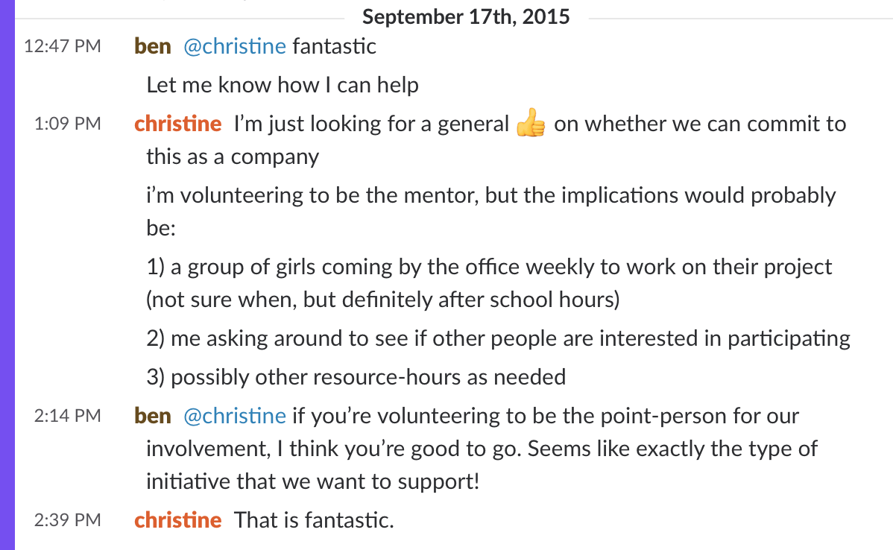
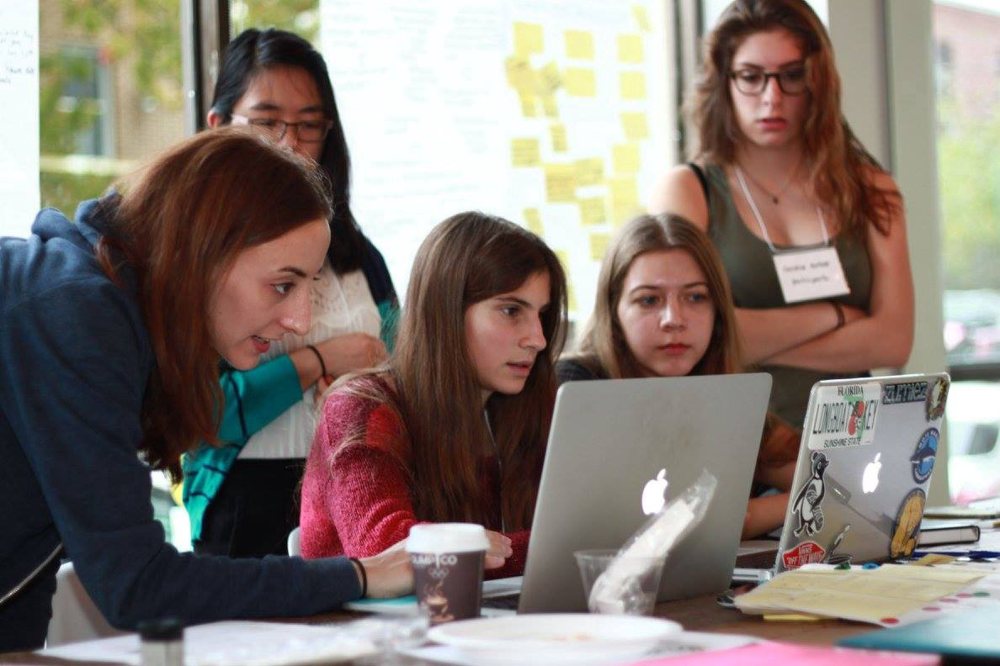
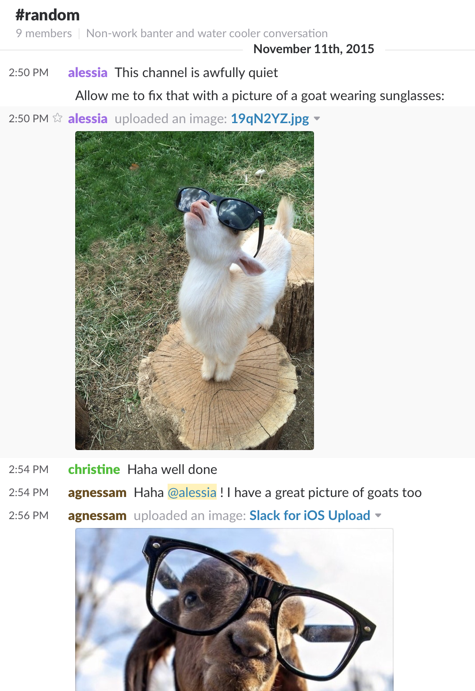
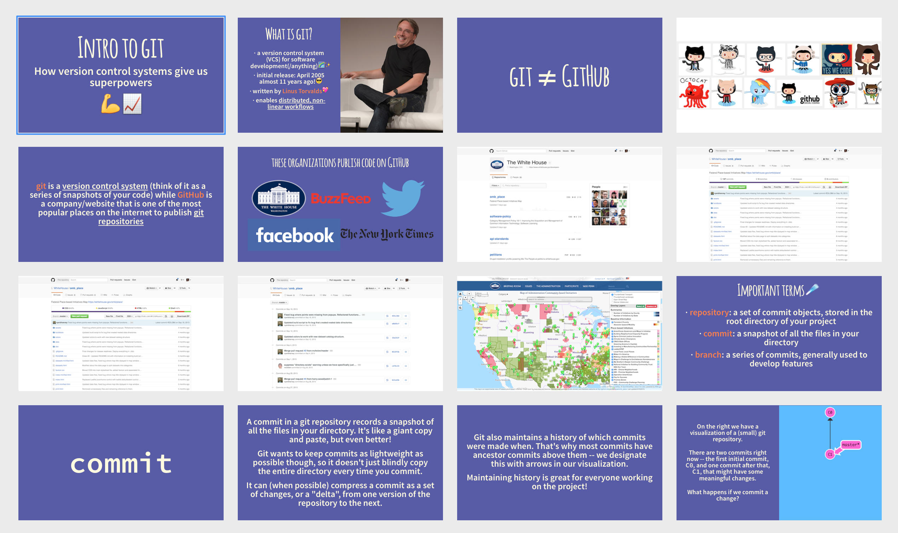

import { ArticleLayout } from '@/components/ArticleLayout'

export const meta = {
  author: 'Alessia Bellisario',
  date: '2016-06-28',
  title: 'Teach a Girl to Program',
  description: 'And a Programmer to Teach',
}

export default (props) => <ArticleLayout meta={meta} {...props} />

It started with a Slack message. A colleague of mine, Christine, had heard about an organization called [Technovation](https://technovationchallenge.org/). Based in San Francisco and with 10 to 18-year-old participants in dozens of countries, Technovation is a competition in which young women build a startup and a mobile app over the course of several months with the guidance of female technologists. This year, the Montreal organizers were seeking companies in the local startup community to mentor teams. Would we be willing to take on a team at Breather?

True to startup form, we arrived at a decision quickly. I pinged Christine to let her know I’d love to help: I had mentored at a few [Canada Learning Code](https://www.canadalearningcode.ca/) workshops and was excited at the prospect of coaching a team of young women. Ever the daughter of a high school teacher and a programmer by day, I thought it would be challenging but fun in the way a really good Sudoku puzzle is.

## Kickoff: Day 0

On October 24 and 25, 2015, a few dozen young women gathered at Montreal’s La Gare for Technovation’s kickoff hackathon. The students were given a primer on the program’s curriculum, then students and mentors were matched up in the afternoon when the work began in earnest. Christine and I were paired up with five 16-year-olds from an all-girls school in Montreal’s Outremont neighbourhood.

The students had to choose a problem domain right away--they could change it later on--but our team quickly decided on building a tool to aid in the process of **finding internships or jobs for teenagers**, a time when they’re beginning to make important decisions about pursuing a career they may or may not have already identified. As part of secondaire 4 and 5 (grades 11 and 12), students at their high school were beginning to search for part-time positions. The whole process left something to be desired: most students found placements through their parents’ professional networks which limited the kinds of careers they were exposed to.

One of the first exercises our team completed came from Google’s design sprint methodology: the students were tasked with quickly and independently sketching the six primary screens of their app-to-be. When the timer buzzed, everyone glanced around at each other’s pages. To their amazement, they had all drawn more or less the same screens: a **search view** with a list of results, a **map with pins** for local establishments that are hiring, a **user profile page**, and so on. This came as a pleasant surprise, if not a relief; for a brief moment, their problem seemed to have a straightforward solution. Think Instagram for jobs.

Our students could identify the problem because they observed its effects every day—a stunning 74% of 100 classmates answered “Yes” to the question “Is it stressful to think about your future career?”—but Christine and I could see the challenges in a software solution based on our own experiences navigating career paths.

Finding the job you’re best suited for is a kind of chicken and egg problem: a young person is more likely to express interest in careers that fit the set of skills/strengths she’s developed, but she’s likely cultivated those skills with a short list of potential careers in mind. Sixteen year old me would be shocked that I wound up a developer mostly because I didn’t have a clue what being a developer entailed.

## What _Does_ Being a Developer Entail?

For a long time, I thought of programming as a job that is in many ways the exact inverse of teaching. The marginal cost of a piece of software, the cost of every additional copy, approaches zero, so software products can grow to an almost inconceivable scale relatively quickly. With over 1 billion users, Facebook’s continued growth is largely constrained by the number of humans on earth with access to the internet (hence Facebook’s [internet-beaming drones](https://www.theguardian.com/technology/2015/jul/31/facebook-finishes-aquila-solar-powered-internet-drone-with-span-of-a-boeing-737)). Software’s reach is broad, but thin and ephemeral, I thought.

I knew that teaching in its current state didn't "scale" in the same way, but I hadn't considered that the impact of a talented educator can be as far-reaching as any piece of software.

Take Ms. Mabel Hefty. A fifth grade teacher at Punahou School in Honolulu in the 1970s, Ms. Hefty probably taught several hundred students in her career. One of them happened to be a young person named Barack Obama, who says she was the first person who taught him that he had something to say. Of course, President Obama had other great teachers and mentors throughout his life, though he often cites Ms. Hefty as his favorite. But the more I considered the potential impact of a great educator, the more I thought: if Internet scale is a proxy for impact, Ms. Hefty’s might rival Facebook’s.

<Tweet
  align="center"
  tweetLink="https://twitter.com/potus44/status/727561463993270272?lang=en"
/>

Tech companies often talk about nurturing relationships with “users”, but the word itself is revealing. If I deploy a bug to production, I never have to watch a user’s face twist in frustration as they struggle to accomplish a simple task. But when I occasionally mangled the explanation of some technical concept and reflexively asked our students “Does that make sense?”, I had to look on in mild horror as five young people turned my poorly-chosen words over in their heads, vaguely pained and confused.

Teaching is not Sudoku. It’s more like stand-up comedy with higher stakes, where your performance is evaluated every 30 seconds and your score conveyed via the facial expressions of smart young people you want nothing more than to help succeed as much as you possibly can.

## Teaching a Programmer to Teach

I knew one thing I'd learned from my dad, a high school English teacher of over thirty years. To him, it's one of the golden rules of teaching and the theme of an [excellent TED talk by educator Rita Pierson](https://www.ted.com/talks/rita_pierson_every_kid_needs_a_champion?language=en#t-450445): **"students don't learn from people they don't like."** Beyond that, well, I didn’t study computer science _or_ education. I studied philosophy, but early on in the mentoring process I knew with a weirdly visceral certainty that I was the perfect person to be giving five 16-year-olds a crash course in JavaScript’s primitive data types.

The night before our first lesson on git, I spent hours crafting slides that answered all of the questions I was too self-conscious to ask in my earliest programming days. Is there a difference between git and GitHub? How do you combine branches once you’re done building a feature? And what exactly is a branch?

Armed with my [deck](https://github.com/alessbell/git_prez/blob/master/git.pdf), a carefully prepared exercise set up in its own [repository](https://github.com/futurenowteam/collaborative_writing) and an irrational confidence in my ability to convey the particulars of a complex decade-old version control system in under two hours, I was as prepared as I’d ever be.

Once the lesson was underway, and much to my relief, they dug into the material without hesitation. I knew the most important thing was to remove any fear of asking the wrong question, trying the wrong approach, committing the wrong code. Learning in an environment where you feel completely comfortable making mistakes is important for reasons beyond the happiness and well-being of students. It also creates the shortest possible feedback loop, allowing you to adjust and improve with every successive attempt.

In retrospect, the _how_ of Technovation, the way we learned and worked as a team, was probably as critical as the content of the curriculum. Learning and building through iterative processes allows for faster progress.

## Survey, Test, Interview, Repeat

And it wasn’t just in the programming portion that we embraced this approach. In order to test certain assumptions the team was making about how best to solve their problem, Christine had the idea of having them implement a “concierge” version of their idea before writing a line of code. Our team went through the motions of manually helping a few classmates land internships and realized it was actually way less straightforward than they’d imagined. Even when they were able to make warm introductions to professionals in fields their classmates were interested in, students were daunted at the prospect of reaching out to a professional they didn’t know.

A large portion of the six months of Techovation were spent this way: survey, test, interview, repeat. After testing our ideas, we realized the importance of two things: 1) that students have the opportunity to interact with professionals of diverse backgrounds, and 2) that students feel comfortable communicating on the platform.

The solution our team arrived at was a digital network in which a high school student has access to school alumni who are organized by industry and students are prompted with helpful conversation starters when they’d like to ask a question of one. Under the hood, it’s a responsive web app built with Meteor (here’s the [source code](https://github.com/futurenowteam/futurenow.com)).

<YouTube youTubeId="hKmiHX_SWYk" />

<YouTube youTubeId="3fqeyTYEk70" />

This was maybe the most exciting takeaway of Technovation: as programming becomes a tool more and more people use to create, the kinds of software being made will naturally diversify. As our team learned, some of the hardest problems in software are in understanding the needs and aspirations of those you hope to serve.

## Postscript

Most people I spoke with about Technovation over the past nine months assumed its goal is to encourage more young women to pursue careers in technology and entrepreneurship. Our team was interviewed by reporters several times—[once by Radio-Canada](http://ici.radio-canada.ca/emissions/la_sphere/2015-2016/chronique.asp?idChronique=406096), for example—and the question of career path was a common one. Did they now suddenly have dreams of going into tech? Each time our students politely answered, “Well… maybe!” They’re interested in all kinds of things, from medicine to law to the arts. It’s hard to say when you’re 16.

The more often adults asked the career question, though, the more I realized it’s beside the point. As much as I know that increasing the proportion of marginalized and underrepresented folks in tech is intrinsically valuable and important, I don’t actually have any vested interest in these five smart young women becoming programmers or entrepreneurs. What I do have a vested interest in is that they feel empowered to solve problems they deem interesting and worthy of their time, because that is in all of our interests.

In that way, Technovation isn’t really about technology or innovation at all: it’s about teaching young people (and reminding adults) of the importance of setting your sights on a wildly ambitious objective, even, or maybe especially, when the path to achieving it is unclear. You might not know how you’re going to get there, but you are sure you’re going to figure it out.
